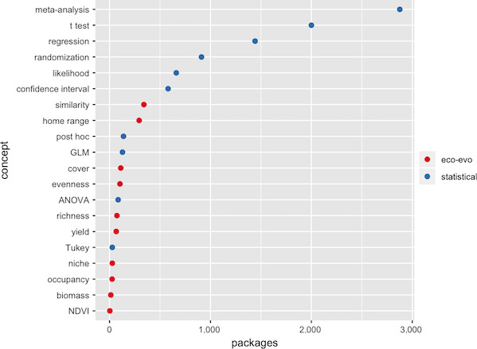

Today {.centered}
----

> - Syllabus
 - Why learn R?
 - Essential programs/packages
 - Free resources
 - R as a calculator

Course Info
----

|**Hyatt Green**|**Elie Gurarie**|
---|------------------------------|------------------------------|
| Email: hgreen@esf.edu | Email: egurarie@esf.edu |
| Phone: 315-470-4814 | Phone: 315-470-3817 |
| Office: 201 Illick Hall | Office: 206 Illick Hall |
| Office hours: W 1-2pm | Office hours: M 2-3pm |

**Credits**: 2    
**Meets**: MW, 10:35-11:30am | 309 Baker    
**Course Materials Website**: https://eligurarie.github.io/EFB654

Go to DRAFT Syllabus
----

 
https://eligurarie.github.io/EFB654/syllabus.html

Big changes coming this week.

This is hard! Why do this?
----

> - Save your time
    + building off of previously designed methods (by you or others)
 - Improves the appearance of your work (R + other tools)
 - Actually helps you perform *better* research
    + take 'bad' shortcuts less often
    + permits thorough criticism
 - Organizes your work (which helps you do all of the above)
 - Improves access to your work (e.g., research compendia)
 - More research opportunities
    + permits the analysis of 'large' data (and 'big' data)
 - Big picture: Limits reproducibility/replicability `crisis'
 - Future requirement of scientific journals    

Ideal Habits During and After Class
----

> - With R, you often plan and build a foundation to your analyses
 - Not only *learn R* but also *practice R*
 - Choose to use R even though it might cost you a little time in the beginning
 - Encourage others to learn R
 
R and Associated Programs
----

| Tool | Type | Purpose |
|------|------|---------|
| **R** | Programming Language | Statistical computing and graphics language for data analysis |
| **RStudio** | IDE (Integrated Development Environment) | User-friendly interface that makes working with R easier - provides code editor, console, and visualization tools all in one place |
| **knitr** | R Package | Evaluates and translates R code embedded in documents, enabling dynamic report generation |
| **RMarkdown** | R Package | Combines plain text with embedded R code, creating reproducible documents |

RStudio provides the workspace → RMarkdown documents contain your text and code → knitr processes the R code → Final document is produced (PDF, HTML, etc.)

What is R?
----

 - Programming *language*
    - it has its own syntax
    - if you learn it, you can make R do stuff for you
 - Programming *environment*
    - Not just a list of tools
    - but a "fully planned and coherent system"
    - permits creation of new tools and new clusters of tools called *packages*

What does R do?
----

> - statistics
 - plotting
 - data handling, manipulation, and efficient storage
 - drafting
 - designing websites
 - developing interactive tools
 - you can make R do pretty much anything (see [r.bloggers](http://www.r-bloggers.com))

Advantages of R
----

 - Free, open source
 - Seemingly endless number of packages for pretty much any type of data analysis you can imagine
 - the *latest* analysis tools
 - Large, usually helpful, community of users (see [stackoverflow](https://stackoverflow.com/questions/tagged/r))
 - Tools for communicating results (easily accessible through RStudio)
 - LLM AI assistants like Claude, Gemini, ChatGPT know R well

Disadvantages of R
----

 - Much of the written code you'll see is sloppy
    + Authors are focused on the results. Hasty.
    + Diverse backgrounds
 - Inconsistent
    + Many packages for the same purpose
    + Many special cases to remember
 - Not that fast. Poorly written code can be really slow.

Redundant R Packages
----

from Lortie et al. 2020

Accessing R
----

 - R
 - R Studio
 - Terminal (Mac)

R as a Calculator
----

 - arithmetic
 - basic functions `mean()`, `sd()`, `Sys.time()`
 - help with specific functions
 - `demo()` to check out R capabilities

Accessing More R Resources
----

> - CRAN
 - Task Views
 - Quick-R
 - R-bloggers
 - Advanced R
 - [stackoverflow](https://stackoverflow.com/questions/tagged/r)
 - Google (helps to know specific terms)

R Studio
----

 - **I**tegrated **D**evelopment **E**nvironment
 - Offers quick point-and-click access to stuff you otherwise have to type in longhand
    + files
    + plots
    + packages
    + creating documents
    + etc
 - Requires R still

Go to R Studio
----

RMarkdown
----

 - Drafting language designed to be simple and intuitive
 - Allows embedding of R code

knitr
----

 - 'knits' R code and output (plots, etc) into Rmarkdown
 - Produces many different types of output
    + pdf
    + html
    + docx
 - Does not do any analysis for you, just formats the output

Why learn Rmarkdown/knitr?
----

``The goal of reproducible research is to tie specific instructions to data analysis and experimental data so that scholarship can be recreated, better understood and verified.'' - CRAN

Questions?
----
 

