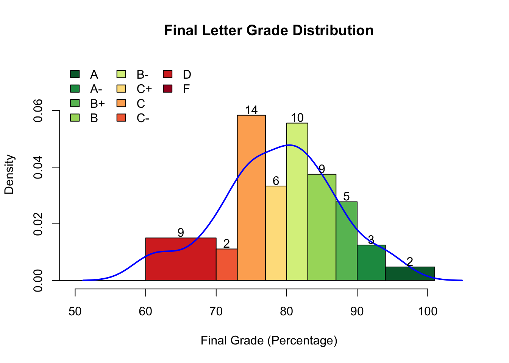

```{r echo=F}
knitr::opts_knit$set(keep.md = TRUE)
```

```{r echo=F, warning=FALSE, eval=TRUE}
library(knitr)
opts_chunk$set(echo=T, eval=T,
               fig.align='center',
               fig.width=4.5,
               fig.height=3)
```

Plots in R
----

 1. R's built-in statistical graphics in the `graphics` package (already attached, use `sessionInfo()`)
 2. Plotting parameters in `par()`
 3. `R`'s basic colors
 4. `RColorBrewer` package

Built-in Statistical Graphics
----

  Plot Type               R function        Objective
  ---------               ----------        -----------------
  Histogram               `hist()`          Statistical distributions
  Boxplot                 `boxplot()`       Statistical distributions
  Barplot                 `barplot()`       Categorical data
  Scatterplot             `plot()`          Numerical data
  Regression diagnostics  `plot()`          Assessing model fit

 : Common plot types, functions, and objectives

Histogram
----
 
 - `rnorm()` 
 - `hist()`
 - `density()`
 - `lines()`

Histogram
----
<!--Nothing makes better histogram data than numbers sampled from a normal distribution -->
```{r eval=FALSE}
?rnorm
```
```{r}
norm.dat<-rnorm(10000, 50, sd=10)
head(norm.dat)
```

Usually takes a vector of numeric...

Histogram
----

...but can also be a numeric matrix
```{r}
data(volcano)
hist(volcano)
```

Histogram
----

```{r}
hist(norm.dat)
```

Histogram (behind the scenes)
----

<PRE>
hist(x, breaks = "Sturges",
     freq = NULL, probability = !freq,
     include.lowest = TRUE, right = TRUE,
     density = NULL, angle = 45, col = NULL, 
     border = NULL,
     main = paste("Histogram of" , xname),
     xlim = range(breaks), ylim = NULL,
     xlab = xname, ylab,
     axes = TRUE, plot = TRUE, labels = FALSE,
     nclass = NULL, warn.unused = TRUE, ...)
</PRE>

 - **`x`** = numeric data (vector)
 - **`breaks`** = how to perform binning, i.e., the # of bins
    + specified in multiple ways, see `?hist`

`breaks` are customizable
----

```{r echo=F, out.width="250px"}

```

Histogram (behind the scenes)
----

<PRE>
hist(x, breaks = "Sturges",
     freq = NULL, probability = !freq,
     include.lowest = TRUE, right = TRUE,
     density = NULL, angle = 45, col = NULL, 
     border = NULL,
     main = paste("Histogram of" , xname),
     xlim = range(breaks), ylim = NULL,
     xlab = xname, ylab,
     axes = TRUE, plot = TRUE, labels = FALSE,
     nclass = NULL, warn.unused = TRUE, ...)
</PRE>

 - **`freq`** = show frequencies (`T`) or probabilities (`F`)
 - **`xlim`** = x min and max (numeric vector of 2)
 - **`ylim`** = y min and max (numeric vector of 2)
 
Histogram
----

```{r echo=-1}
par(cex=0.6)
hist(norm.dat, breaks=100, xlim=c(50,90))
```

Histogram
----

```{r}
hist(norm.dat, breaks=100, 
     xlim=c(50,90), freq = F) # Must change to freq = F
lines(density(norm.dat)) # see ?density and ?lines
```

Boxplot
----

 - `boxplot()`
 - `par()`

Boxplot
----
 
```{r}
library(ggplot2)
data(msleep) # ?msleep
str(msleep)
```

Change `vore` to factor
----

```{r}
msleep$vore<-factor(msleep$vore)
str(msleep)
```

Boxplot
----

Is there a relationship between ($y$) the total amount of sleep mammals get and ($x$) what they eat?
```{r echo=-1}
par(mar=c(3,4,2,1))
boxplot(sleep_total~vore, msleep)
```

 - `~` = "as a function of" or "as modeled by"
    + `y-axis-data ~ x-axis-data`
 
Boxplot
----

Both `hist()` and `boxplot()` return information in addition to the plot.

 - Decorate the plot more or provide statistics (median, etc)

```{r}
bp.data<-boxplot(sleep_total~vore, msleep, plot=F)
str(bp.data)
```

# `par()`

`par()`
----

 - Access to all graphical **par**ameters
 - The function `par()` returns a special **named list** of values
 
```{r}
par()
```

`par()`
----

 - Like a list, you can index it.

```{r}
par()[1:2]
```

`par()`
----

```{r fig.height=2, echo=-1}
par(mar=c(3,4,2,1))
par("fg")
par(fg="blue", lwd=3)
boxplot(sleep_total~vore, msleep)
```

`par()`
----

```{r fig.height=2, echo=-1}
par(mar=c(3,4,2,1))
par("cex")
par(cex=0.7)
boxplot(sleep_total~vore, msleep)
```

`par()`
----

 - `par()` contains `r length(par())` parameters
 
```{r}
length(par())
head(names(par()), 50)
```

`par()` tips
----

 - If changed in `par()`, will be changed **globally** until reset manually or R session terminated
 - Can be specified within plot function to change temporarily (e.g., `plot(y~x, data, col="red")`)
 - **OR**, *always use `knitr` and RMarkdown.* `par()` resets every code chunk, *unless* you tell it not to.

Scatterplots
----

 - `plot()`
 - `legend()`

Scatterplots
----

 - Simply use the generic command `plot()`
 
```{r echo=-1, fig.height=2}
par(mar=c(4,4,1,1))
plot(sleep_total~bodywt, msleep)
```

Scatterplots
----

 - `plot()` knows to make a scatterplot with "numeric ~ numeric" input
 
```{r echo=-1, fig.height=2}
par(mar=c(4,4,1,1))
plot(sleep_total~vore, msleep) 
# Decides it's a job for boxplot
```

Scatterplots
----

 - Simply use the generic command `plot()`
 
```{r echo=-1, fig.height=2}
par(mar=c(4,4,1,1))
plot(sleep_total~bodywt, msleep)
```

Scatterplots
----

 - use `log="x"` and `log="y"` to log transform **axis**, not the data
 - use `log="xy"` to transform both axes
 
```{r echo=-1, fig.height=2}
par(mar=c(4,4,1,1))
plot(sleep_total~bodywt, msleep, 
     log="x", cex.lab=1.5, lwd=2)
```

# Colors

Very, very basic R colors
----

 - **Names**: "black", "red", "green", "blue", "cyan", "magenta", "yellow", "grey" (or "gray")
 - **Number**: 1, 2, 3, 4, 5, 6, 7, 8
 - Recycles to infinity
    + i.e., 9 = "black", 10 = "red",  so on
 - Also have "white"
 - 0 = "transparent"

Very, very basic R colors
----

```{r echo=-1}
par(mar=c(4,4,1,1))
x<-y<-1:20 # Yes, you can do this
plot(y~x, col=x, pch=16, cex=4)
```

Scatterplots: Add a Legend based on `vore`
----

```{r echo=-c(1,2)}
par(mar=c(4,4,1,1))
par(cex.lab=1.5, lwd=2)
plot(sleep_total~bodywt, msleep, log="x")
```

Scatterplots: Add a Legend based on `vore`
----

```{r}
head(msleep$vore, 10)
head(as.integer(msleep$vore), 10)
levels(msleep$vore)
```

Scatterplots: Add a Legend based on `vore`
----

```{r echo=-1}
par(cex.lab=1.5, lwd=2, cex=0.8)
plot(sleep_total~bodywt, msleep, log="x", col=msleep$vore)
legend("topright", legend=levels(msleep$vore), 
       col=1:4, pch=1)
```

Plotting Exercise
----

1.Using the `rhone` dataset in the `ade4` package, plot a variable of your choice as a function of `air.temp`. Add plain english axis labels and a title for the plot.

2.Increase the expansion factor by 25% and remove the box around the plot.

3.Change data symbols from small circles to triangles.


Plotting Exercise
----

1.Using the `rhone` dataset in the `ade4` package, plot a variable of your choice as a function of `air.temp`. Add plain english axis labels and a title for the plot.

```{r}
library(ade4)
data(rhone)
str(rhone)
```

Plotting Exercise
----

1.Using the `rhone` dataset in the `ade4` package, plot a variable of your choice as a function of `air.temp`. Add plain english axis labels and a title for the plot.

```{r echo=-1, eval=T, fig.height=1.7}
par(mar=c(4,4,1,1), cex=0.7)
rh<-rhone$tab
plot(conduc~air.temp, rh, xlab="Air Temperature",
     ylab="Conductivity",
     main="Rhone River Conductivity vs Air Temperature")
```

Plotting Exercise
----

2.Increase the size of everything by 25% (a.k.a. expansion factor), double the line thickness of the symbols, and remove the box around the plot.

```{r echo=-1, fig.height=2}
par(mar=c(4,4,1,1), cex=0.7)
par(cex=1.25, lwd=2, bty="n")
plot(conduc~air.temp, rh, xlab="Air Temperature",
     ylab="Conductivity",
     main="Rhone River Conductivity vs Air Temperature")
```

Plotting Exercise
----

3.Change data symbols from small circles to triangles.

```{r echo=-1, fig.height=2}
par(mar=c(4,4,1,1))
par(cex=1.25, lwd=2, bty="n", pch=2)
plot(conduc~air.temp, rh, xlab="Air Temperature",
     ylab="Conductivity",
     main="Rhone River Conductivity vs Air Temperature")
```
