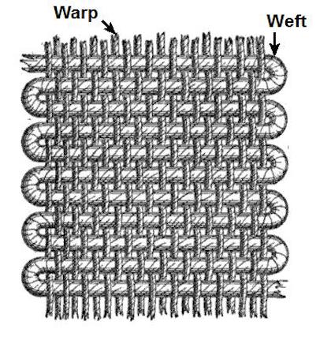

```{r setup, include=FALSE}
knitr::opts_chunk$set(echo = TRUE)
```

Today
----

 - Quick tables with `table()` and `ftable()`
 - `summary()`
 - Aggregating data with `aggregate()`

# Data Summaries

Tables
----

 - `table()`
 - `ftable()`

Contingency Tables
----

- Useful for counting occurrences of factor levels, characters, or small ranges of integers.
- Typically used at the early stages of an analysis, but not necessarily.
 
```{r}
let <- rep(LETTERS[1:4], times=4)
let
table(let)
```

Contingency Tables
----

Count factor levels on the `esoph` dataset

```{r}
data(esoph)
str(esoph)
```

Esophageal Cancer Tumors
----


Contingency Tables
----

Two-way table: `agegp` vs `tobgp`

```{r}
etab <- table(esoph[, c("agegp", "tobgp")])
etab
```

Contingency Tables
----

Three-way: `agegp` vs `tobgp` vs `alcgp`

```{r}
etab3d <- table(esoph[, c("agegp", "tobgp", "alcgp")])
str(etab3d)
```

 - Result is a 3D array of counts
 - Hard to read when printed raw

Flat Contingency Tables: `ftable()`
----

```{r}
ft3d <- ftable(esoph[, c("agegp", "tobgp", "alcgp")])
ft3d
```

Flat Contingency Tables: `ftable()`
----

What groups are we missing?

```{r}
ft.df <- as.data.frame(ft3d)
dim(ft.df)
head(ft.df)
```

Flat Contingency Tables: `ftable()`
----

What groups are we missing?

```{r}
ft.df[ft.df$Freq == 0, ]
```

# `summary()`

`summary()`
----

"Generic" function --- its behavior depends on the class of the object.

```{r}
methods(summary)
```

`summary()`
----

```{r}
summary(1:1000)
```

`summary()`
----

```{r}
summary(esoph)
```

 - Numeric columns: min, quartiles, mean, max
 - Factor columns: counts of levels

`summary()`
----

Also works on individual columns:

```{r}
summary(esoph$agegp)
summary(esoph$ncases)
```

# Aggregating Data

`aggregate()`
----

 - Useful for finding means, sd, or custom calculations within levels of a factor
    + like pivot tables in Excel
    
```{r}
?aggregate
```

 - Has a few different variations: `data.frame`, `formula`, `ts` (time series)

```{r}
methods(aggregate)
```

Warp and Weft
----



```{r}
data(warpbreaks)
```

`warpbreaks` dataset
----

 - Number of warp breaks per loom with different types of wool and tension levels

```{r}
str(warpbreaks)
summary(warpbreaks)
```

`aggregate()` (formula usage)
----

```{r, eval=FALSE}
?aggregate
```

<PRE>
## S3 method for class 'formula'
aggregate(formula, data, FUN, ...,
          subset, na.action = na.omit)
</PRE>

> - `formula`  = "aggregate `y~x` variables found in `data`"
    + `y` is usually numeric and `x` is usually a factor
 - `FUN`  = function to apply to each group
 - `...`  = other arguments to be passed to your `FUN` (e.g. `na.rm`)

`aggregate()` (formula usage)
----

What's the mean number of breaks *within* `wool` type?

```{r}
aggregate(breaks ~ wool, warpbreaks, FUN = mean)
```

`aggregate()` (formula usage)
----

What's the mean number of breaks within all possible pairings of `wool` type *and* `tension`?

```{r}
aggregate(breaks ~ wool + tension, warpbreaks, FUN = mean)
```

`aggregate()`
----

Only one aggregation function allowed.

```{r, error=TRUE}
aggregate(breaks ~ wool, warpbreaks, FUN = c(mean, sd))
```

 - We'll see a workaround for this later with `ddply()`

Quick Exercise
----

Using `aggregate()`, find the **mean** support for the statusquo (`statusquo`) of surveyed individuals within each `region` in the `Chile` data set in package `carData`.

----

```{r}
library(carData)
data(Chile)
str(Chile)
```

----

```{r}
head(Chile)
```

----

Using `aggregate()`, find the **mean** support for the statusquo (`statusquo`) of surveyed individuals within each `region` in the `Chile` data set in package `carData`.

```{r}
aggregate(statusquo ~ region, Chile, mean)
```

Aggregating multiple response variables
----

You can aggregate more than one numeric variable at a time using `cbind()` on the left side of the formula:

```{r}
aggregate(cbind(statusquo, income) ~ region, Chile, mean, na.rm = TRUE)
```

Exercise with `aggregate()`
----

Using the `ggplot2::diamonds` dataset, plot the median `price` as a function of median `carat` size of diamonds both grouped by `cut`. 

*Tip: you should end up with a scatter plot with only five points.*

```{r}
library(ggplot2)
data("diamonds")
head(diamonds)
```

Exercise with `aggregate()`
----

```{r}
d_price <- aggregate(price ~ cut, diamonds, median)
d_price
```

Exercise with `aggregate()`
----

```{r}
d_carat <- aggregate(carat ~ cut, diamonds, median)
d_carat
```

Exercise with `aggregate()`
----

```{r}
d_pc <- cbind(d_price, carat = d_carat[, 2])
d_pc
```

Exercise with `aggregate()`
----

```{r}
plot(price ~ carat, d_pc, pch = 19, 
     main = "Median price vs. median carat by cut")
text(d_pc$carat, d_pc$price, labels = d_pc$cut, pos = 3, cex = 0.8)
```

Summary
----

| Function | Purpose | Input | Output |
|---|---|---|---|
| `table()` | Count occurrences | vectors, df columns | contingency table |
| `ftable()` | Flatten multi-way table | table or df columns | flat table |
| `summary()` | Quick numeric/factor summary | almost anything | summary object |
| `aggregate()` | Apply FUN by groups | formula + data | data frame |

Next time
----

 - Merging data with `merge()`
 - Binding data with `cbind()` and `rbind()`
