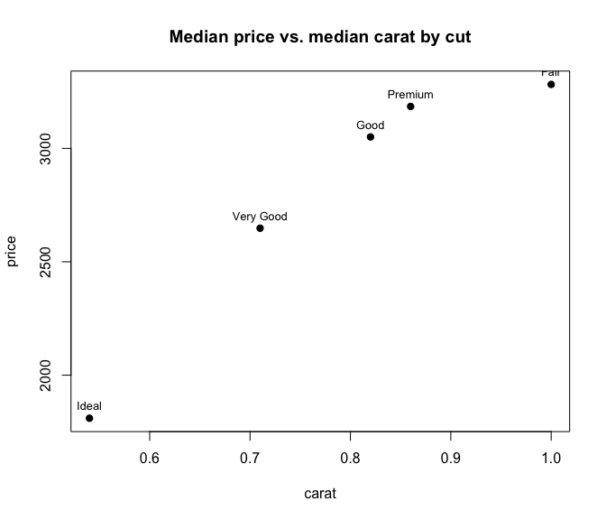

Today
----

 - Quick tables with `table()` and `ftable()`
 - `summary()`
 - Aggregating data with `aggregate()`

# Data Summaries

Tables
----

 - `table()`
 - `ftable()`

Contingency Tables
----

- Useful for counting occurrences of factor levels, characters, or small ranges of integers.
- Typically used at the early stages of an analysis, but not necessarily.
 

``` r
let <- rep(LETTERS[1:4], times=4)
let
```

```
##  [1] "A" "B" "C" "D" "A" "B" "C" "D" "A" "B" "C" "D" "A" "B" "C" "D"
```

``` r
table(let)
```

```
## let
## A B C D 
## 4 4 4 4
```

Contingency Tables
----

Count factor levels on the `esoph` dataset


``` r
data(esoph)
str(esoph)
```

```
## 'data.frame':	88 obs. of  5 variables:
##  $ agegp    : Ord.factor w/ 6 levels "25-34"<"35-44"<..: 1 1 1 1 1 1 1 1 1 1 ...
##  $ alcgp    : Ord.factor w/ 4 levels "0-39g/day"<"40-79"<..: 1 1 1 1 2 2 2 2 3 3 ...
##  $ tobgp    : Ord.factor w/ 4 levels "0-9g/day"<"10-19"<..: 1 2 3 4 1 2 3 4 1 2 ...
##  $ ncases   : num  0 0 0 0 0 0 0 0 0 0 ...
##  $ ncontrols: num  40 10 6 5 27 7 4 7 2 1 ...
```

Esophageal Cancer Tumors
----


Contingency Tables
----

Two-way table: `agegp` vs `tobgp`


``` r
etab <- table(esoph[, c("agegp", "tobgp")])
etab
```

```
##        tobgp
## agegp   0-9g/day 10-19 20-29 30+
##   25-34        4     4     3   4
##   35-44        4     4     4   3
##   45-54        4     4     4   4
##   55-64        4     4     4   4
##   65-74        4     4     4   3
##   75+          4     4     1   2
```

Contingency Tables
----

Three-way: `agegp` vs `tobgp` vs `alcgp`


``` r
etab3d <- table(esoph[, c("agegp", "tobgp", "alcgp")])
str(etab3d)
```

```
##  'table' int [1:6, 1:4, 1:4] 1 1 1 1 1 1 1 1 1 1 ...
##  - attr(*, "dimnames")=List of 3
##   ..$ agegp: chr [1:6] "25-34" "35-44" "45-54" "55-64" ...
##   ..$ tobgp: chr [1:4] "0-9g/day" "10-19" "20-29" "30+"
##   ..$ alcgp: chr [1:4] "0-39g/day" "40-79" "80-119" "120+"
```

 - Result is a 3D array of counts
 - Hard to read when printed raw

Flat Contingency Tables: `ftable()`
----


``` r
ft3d <- ftable(esoph[, c("agegp", "tobgp", "alcgp")])
ft3d
```

```
##                alcgp 0-39g/day 40-79 80-119 120+
## agegp tobgp                                     
## 25-34 0-9g/day               1     1      1    1
##       10-19                  1     1      1    1
##       20-29                  1     1      0    1
##       30+                    1     1      1    1
## 35-44 0-9g/day               1     1      1    1
##       10-19                  1     1      1    1
##       20-29                  1     1      1    1
##       30+                    1     1      1    0
## 45-54 0-9g/day               1     1      1    1
##       10-19                  1     1      1    1
##       20-29                  1     1      1    1
##       30+                    1     1      1    1
## 55-64 0-9g/day               1     1      1    1
##       10-19                  1     1      1    1
##       20-29                  1     1      1    1
##       30+                    1     1      1    1
## 65-74 0-9g/day               1     1      1    1
##       10-19                  1     1      1    1
##       20-29                  1     1      1    1
##       30+                    1     0      1    1
## 75+   0-9g/day               1     1      1    1
##       10-19                  1     1      1    1
##       20-29                  0     1      0    0
##       30+                    1     1      0    0
```

Flat Contingency Tables: `ftable()`
----

What groups are we missing?


``` r
ft.df <- as.data.frame(ft3d)
dim(ft.df)
```

```
## [1] 96  4
```

``` r
head(ft.df)
```

```
##   agegp    tobgp     alcgp Freq
## 1 25-34 0-9g/day 0-39g/day    1
## 2 35-44 0-9g/day 0-39g/day    1
## 3 45-54 0-9g/day 0-39g/day    1
## 4 55-64 0-9g/day 0-39g/day    1
## 5 65-74 0-9g/day 0-39g/day    1
## 6   75+ 0-9g/day 0-39g/day    1
```

Flat Contingency Tables: `ftable()`
----

What groups are we missing?


``` r
ft.df[ft.df$Freq == 0, ]
```

```
##    agegp tobgp     alcgp Freq
## 18   75+ 20-29 0-39g/day    0
## 47 65-74   30+     40-79    0
## 61 25-34 20-29    80-119    0
## 66   75+ 20-29    80-119    0
## 72   75+   30+    80-119    0
## 90   75+ 20-29      120+    0
## 92 35-44   30+      120+    0
## 96   75+   30+      120+    0
```

# `summary()`

`summary()`
----

"Generic" function --- its behavior depends on the class of the object.


``` r
methods(summary)
```

```
##  [1] summary.aov                         summary.aovlist*                   
##  [3] summary.aspell*                     summary.check_packages_in_dir*     
##  [5] summary.connection                  summary.data.frame                 
##  [7] summary.Date                        summary.default                    
##  [9] summary.difftime                    summary.ecdf*                      
## [11] summary.factor                      summary.glm                        
## [13] summary.infl*                       summary.lm                         
## [15] summary.loess*                      summary.manova                     
## [17] summary.matrix                      summary.mlm*                       
## [19] summary.nls*                        summary.packageStatus*             
## [21] summary.POSIXct                     summary.POSIXlt                    
## [23] summary.ppr*                        summary.prcomp*                    
## [25] summary.princomp*                   summary.proc_time                  
## [27] summary.rlang_error*                summary.rlang_message*             
## [29] summary.rlang_trace*                summary.rlang_warning*             
## [31] summary.rlang:::list_of_conditions* summary.srcfile                    
## [33] summary.srcref                      summary.stepfun                    
## [35] summary.stl*                        summary.table                      
## [37] summary.tukeysmooth*                summary.warnings                   
## see '?methods' for accessing help and source code
```

`summary()`
----


``` r
summary(1:1000)
```

```
##    Min. 1st Qu.  Median    Mean 3rd Qu.    Max. 
##     1.0   250.8   500.5   500.5   750.2  1000.0
```

`summary()`
----


``` r
summary(esoph)
```

```
##    agegp          alcgp         tobgp        ncases         ncontrols     
##  25-34:15   0-39g/day:23   0-9g/day:24   Min.   : 0.000   Min.   : 0.000  
##  35-44:15   40-79    :23   10-19   :24   1st Qu.: 0.000   1st Qu.: 1.000  
##  45-54:16   80-119   :21   20-29   :20   Median : 1.000   Median : 4.000  
##  55-64:16   120+     :21   30+     :20   Mean   : 2.273   Mean   : 8.807  
##  65-74:15                                3rd Qu.: 4.000   3rd Qu.:10.000  
##  75+  :11                                Max.   :17.000   Max.   :60.000
```

 - Numeric columns: min, quartiles, mean, max
 - Factor columns: counts of levels

`summary()`
----

Also works on individual columns:


``` r
summary(esoph$agegp)
```

```
## 25-34 35-44 45-54 55-64 65-74   75+ 
##    15    15    16    16    15    11
```

``` r
summary(esoph$ncases)
```

```
##    Min. 1st Qu.  Median    Mean 3rd Qu.    Max. 
##   0.000   0.000   1.000   2.273   4.000  17.000
```

# Aggregating Data

`aggregate()`
----

 - Useful for finding means, sd, or custom calculations within levels of a factor
    + like pivot tables in Excel
    

``` r
?aggregate
```

 - Has a few different variations: `data.frame`, `formula`, `ts` (time series)


``` r
methods(aggregate)
```

```
## [1] aggregate.data.frame aggregate.default*   aggregate.formula*  
## [4] aggregate.ts        
## see '?methods' for accessing help and source code
```

Warp and Weft
----


``` r
data(warpbreaks)
```

`warpbreaks` dataset
----

 - Number of warp breaks per loom with different types of wool and tension levels


``` r
str(warpbreaks)
```

```
## 'data.frame':	54 obs. of  3 variables:
##  $ breaks : num  26 30 54 25 70 52 51 26 67 18 ...
##  $ wool   : Factor w/ 2 levels "A","B": 1 1 1 1 1 1 1 1 1 1 ...
##  $ tension: Factor w/ 3 levels "L","M","H": 1 1 1 1 1 1 1 1 1 2 ...
```

``` r
summary(warpbreaks)
```

```
##      breaks      wool   tension
##  Min.   :10.00   A:27   L:18   
##  1st Qu.:18.25   B:27   M:18   
##  Median :26.00          H:18   
##  Mean   :28.15                 
##  3rd Qu.:34.00                 
##  Max.   :70.00
```

`aggregate()` (formula usage)
----


``` r
?aggregate
```

<PRE>
## S3 method for class 'formula'
aggregate(formula, data, FUN, ...,
          subset, na.action = na.omit)
</PRE>

> - `formula`  = "aggregate `y~x` variables found in `data`"
    + `y` is usually numeric and `x` is usually a factor
 - `FUN`  = function to apply to each group
 - `...`  = other arguments to be passed to your `FUN` (e.g. `na.rm`)

`aggregate()` (formula usage)
----

What's the mean number of breaks *within* `wool` type?


``` r
aggregate(breaks ~ wool, warpbreaks, FUN = mean)
```

```
##   wool   breaks
## 1    A 31.03704
## 2    B 25.25926
```

`aggregate()` (formula usage)
----

What's the mean number of breaks within all possible pairings of `wool` type *and* `tension`?


``` r
aggregate(breaks ~ wool + tension, warpbreaks, FUN = mean)
```

```
##   wool tension   breaks
## 1    A       L 44.55556
## 2    B       L 28.22222
## 3    A       M 24.00000
## 4    B       M 28.77778
## 5    A       H 24.55556
## 6    B       H 18.77778
```

`aggregate()`
----

Only one aggregation function allowed.


``` r
aggregate(breaks ~ wool, warpbreaks, FUN = c(mean, sd))
```

```
## Error in `get()`:
## ! object 'FUN' of mode 'function' was not found
```

 - We'll see a workaround for this later with `ddply()`

Quick Exercise
----

Using `aggregate()`, find the **mean** support for the statusquo (`statusquo`) of surveyed individuals within each `region` in the `Chile` data set in package `carData`.

----


``` r
library(carData)
data(Chile)
str(Chile)
```

```
## 'data.frame':	2700 obs. of  8 variables:
##  $ region    : Factor w/ 5 levels "C","M","N","S",..: 3 3 3 3 3 3 3 3 3 3 ...
##  $ population: int  175000 175000 175000 175000 175000 175000 175000 175000 175000 175000 ...
##  $ sex       : Factor w/ 2 levels "F","M": 2 2 1 1 1 1 2 1 1 2 ...
##  $ age       : int  65 29 38 49 23 28 26 24 41 41 ...
##  $ education : Factor w/ 3 levels "P","PS","S": 1 2 1 1 3 1 2 3 1 1 ...
##  $ income    : int  35000 7500 15000 35000 35000 7500 35000 15000 15000 15000 ...
##  $ statusquo : num  1.01 -1.3 1.23 -1.03 -1.1 ...
##  $ vote      : Factor w/ 4 levels "A","N","U","Y": 4 2 4 2 2 2 2 2 3 2 ...
```

----


``` r
head(Chile)
```

```
##   region population sex age education income statusquo vote
## 1      N     175000   M  65         P  35000   1.00820    Y
## 2      N     175000   M  29        PS   7500  -1.29617    N
## 3      N     175000   F  38         P  15000   1.23072    Y
## 4      N     175000   F  49         P  35000  -1.03163    N
## 5      N     175000   F  23         S  35000  -1.10496    N
## 6      N     175000   F  28         P   7500  -1.04685    N
```

----

Using `aggregate()`, find the **mean** support for the statusquo (`statusquo`) of surveyed individuals within each `region` in the `Chile` data set in package `carData`.


``` r
aggregate(statusquo ~ region, Chile, mean)
```

```
##   region   statusquo
## 1      C -0.02983546
## 2      M  0.28677120
## 3      N  0.13556488
## 4      S  0.16496487
## 5     SA -0.17955745
```

Aggregating multiple response variables
----

You can aggregate more than one numeric variable at a time using `cbind()` on the left side of the formula:


``` r
aggregate(cbind(statusquo, income) ~ region, Chile, mean, na.rm = TRUE)
```

```
##   region   statusquo   income
## 1      C -0.04521872 31349.48
## 2      M  0.31627763 26505.38
## 3      N  0.13912207 30764.33
## 4      S  0.16666916 26971.01
## 5     SA -0.20265865 42445.41
```

Exercise with `aggregate()`
----

Using the `ggplot2::diamonds` dataset, plot the median `price` as a function of median `carat` size of diamonds both grouped by `cut`. 

*Tip: you should end up with a scatter plot with only five points.*


``` r
library(ggplot2)
```

```
## Warning: package 'ggplot2' was built under R version 4.5.2
```

``` r
data("diamonds")
head(diamonds)
```

```
## # A tibble: 6 × 10
##   carat cut       color clarity depth table price     x     y     z
##   <dbl> <ord>     <ord> <ord>   <dbl> <dbl> <int> <dbl> <dbl> <dbl>
## 1  0.23 Ideal     E     SI2      61.5    55   326  3.95  3.98  2.43
## 2  0.21 Premium   E     SI1      59.8    61   326  3.89  3.84  2.31
## 3  0.23 Good      E     VS1      56.9    65   327  4.05  4.07  2.31
## 4  0.29 Premium   I     VS2      62.4    58   334  4.2   4.23  2.63
## 5  0.31 Good      J     SI2      63.3    58   335  4.34  4.35  2.75
## 6  0.24 Very Good J     VVS2     62.8    57   336  3.94  3.96  2.48
```

Exercise with `aggregate()`
----


``` r
d_price <- aggregate(price ~ cut, diamonds, median)
d_price
```

```
##         cut  price
## 1      Fair 3282.0
## 2      Good 3050.5
## 3 Very Good 2648.0
## 4   Premium 3185.0
## 5     Ideal 1810.0
```

Exercise with `aggregate()`
----


``` r
d_carat <- aggregate(carat ~ cut, diamonds, median)
d_carat
```

```
##         cut carat
## 1      Fair  1.00
## 2      Good  0.82
## 3 Very Good  0.71
## 4   Premium  0.86
## 5     Ideal  0.54
```

Exercise with `aggregate()`
----


``` r
d_pc <- cbind(d_price, carat = d_carat[, 2])
d_pc
```

```
##         cut  price carat
## 1      Fair 3282.0  1.00
## 2      Good 3050.5  0.82
## 3 Very Good 2648.0  0.71
## 4   Premium 3185.0  0.86
## 5     Ideal 1810.0  0.54
```

Exercise with `aggregate()`
----


``` r
plot(price ~ carat, d_pc, pch = 19, 
     main = "Median price vs. median carat by cut")
text(d_pc$carat, d_pc$price, labels = d_pc$cut, pos = 3, cex = 0.8)
```

<!-- -->

Summary
----

| Function | Purpose | Input | Output |
|---|---|---|---|
| `table()` | Count occurrences | vectors, df columns | contingency table |
| `ftable()` | Flatten multi-way table | table or df columns | flat table |
| `summary()` | Quick numeric/factor summary | almost anything | summary object |
| `aggregate()` | Apply FUN by groups | formula + data | data frame |

Next time
----

 - Merging data with `merge()`
 - Binding data with `cbind()` and `rbind()`
