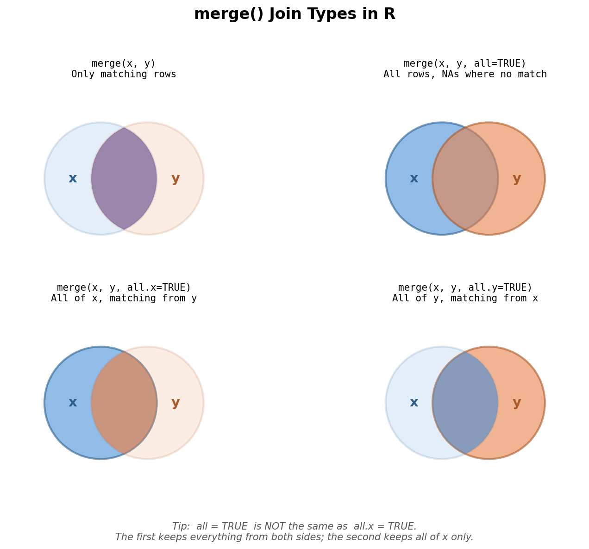

## Patterns

Homework errors fall into a few categories:

 > - Code that runs but doesn't answer the question
 > - Logic errors (`&` vs `|`)
 > - Indexing errors (negative indexing)
 > - Formula interface misuse (`$` inside `aggregate()`)
 > - Merge confusion (`all` vs `all.x`)
 > - Incomplete execution


## Your Code Runs. But Does It Answer the Question?

The most common issue across all homeworks. Valid syntax, wrong result.


``` r
# Q: "Display the first 3 rows of mtcars"
head(mtcars)  # Returns 6 rows -- the default!
```

```
##                    mpg cyl disp  hp drat    wt  qsec vs am gear carb
## Mazda RX4         21.0   6  160 110 3.90 2.620 16.46  0  1    4    4
## Mazda RX4 Wag     21.0   6  160 110 3.90 2.875 17.02  0  1    4    4
## Datsun 710        22.8   4  108  93 3.85 2.320 18.61  1  1    4    1
## Hornet 4 Drive    21.4   6  258 110 3.08 3.215 19.44  1  0    3    1
## Hornet Sportabout 18.7   8  360 175 3.15 3.440 17.02  0  0    3    2
## Valiant           18.1   6  225 105 2.76 3.460 20.22  1  0    3    1
```

`head()` with no second argument returns 6 rows. If the question asks for 3, pass `n = 3`.


``` r
# Correct: specify the number of rows
head(mtcars, 3)
```

```
##                mpg cyl disp  hp drat    wt  qsec vs am gear carb
## Mazda RX4     21.0   6  160 110 3.90 2.620 16.46  0  1    4    4
## Mazda RX4 Wag 21.0   6  160 110 3.90 2.875 17.02  0  1    4    4
## Datsun 710    22.8   4  108  93 3.85 2.320 18.61  1  1    4    1
```


## The Most Common Logic Error

Question: "Subset cars with mpg > 25 **or** 4 cylinders."


``` r
# WRONG: & means BOTH conditions must be true
nrow(mtcars[mtcars$mpg > 25 & mtcars$cyl == 4, ])
```

```
## [1] 6
```


``` r
# RIGHT: | means EITHER condition
nrow(mtcars[mtcars$mpg > 25 | mtcars$cyl == 4, ])
```

```
## [1] 11
```

`&` narrows your results. `|` broadens them. 

<!--Four students used `&` on HW03 Q6c and got 6 rows instead of 11. -->


## Quick truth table

|  mpg > 25  |  cyl == 4  |  `&` (AND) |  `\|` (OR) |
|:----------:|:----------:|:----------:|:----------:|
|   TRUE     |   TRUE     |   TRUE     |   TRUE     |
|   TRUE     |   FALSE    |   FALSE    |   TRUE     |
|   FALSE    |   TRUE     |   FALSE    |   TRUE     |
|   FALSE    |   FALSE    |   FALSE    |   FALSE    |

**Rule of thumb:**

 - "and" = both must be true = fewer rows = `&`
 - "or" = either can be true = more rows = `|`


## Negative Indexing: What Are You Actually Removing?


``` r
temps <- c(freezing = 32, cold = 45, cool = 60,
           warm = 75, hot = 90, boiling = 212)
temps
```

```
## freezing     cold     cool     warm      hot  boiling 
##       32       45       60       75       90      212
```

----

Question: "Remove freezing and boiling (positions 1 and 6)."


``` r
# WRONG: removes the MIDDLE, keeps the extremes
temps[-c(2:5)]
```

```
## freezing  boiling 
##       32      212
```


``` r
# RIGHT: removes positions 1 and 6
temps[-c(1, 6)]
```

```
## cold cool warm  hot 
##   45   60   75   90
```


## The `$` Trap Inside `aggregate()`

From HW06. The formula interface already knows to look inside the `data` argument.


``` r
# WRONG: $ notation inside a formula
aggregate(CO2$uptake ~ CO2$Type, data = CO2, FUN = mean)
```


``` r
# RIGHT: bare column names, data argument does the work
aggregate(uptake ~ Type, data = CO2, FUN = mean)
```

```
##          Type   uptake
## 1      Quebec 33.54286
## 2 Mississippi 20.88333
```


## `cbind()` and Duplicate Columns

When you `cbind()` two `aggregate()` results that share a grouping column:


``` r
agg_mean <- aggregate(uptake ~ Type, data = CO2, FUN = mean)
agg_sd   <- aggregate(uptake ~ Type, data = CO2, FUN = sd)
cbind(agg_mean, agg_sd)
```

```
##          Type   uptake        Type   uptake
## 1      Quebec 33.54286      Quebec 9.673830
## 2 Mississippi 20.88333 Mississippi 7.815773
```

`Type` appears twice. This is messy and can cause problems downstream.


## Fix: drop the duplicate before binding


``` r
cbind(agg_mean, agg_sd[, -1, drop = FALSE])
```

```
##          Type   uptake   uptake
## 1      Quebec 33.54286 9.673830
## 2 Mississippi 20.88333 7.815773
```

Or better yet, use `merge()`:


``` r
merge(agg_mean, agg_sd, by = "Type", suffixes = c("_mean", "_sd"))
```

```
##          Type uptake_mean uptake_sd
## 1 Mississippi    20.88333  7.815773
## 2      Quebec    33.54286  9.673830
```


##




## `merge()` Common Confusion

The most frequent HW06 error: confusing `all = TRUE` with `all.x = TRUE`.


``` r
sites   <- data.frame(site = c("A", "B", "C"),
                       habitat = c("forest", "wetland", "field"))
surveys <- data.frame(site = c("B", "C", "D"),
                       count = c(12, 8, 15))
```


``` r
merge(sites, surveys)                  # Inner: only B and C
```

```
##   site habitat count
## 1    B wetland    12
## 2    C   field     8
```


## Comparing the join arguments


``` r
merge(sites, surveys, all.x = TRUE)   # Left: all of sites
```

```
##   site habitat count
## 1    A  forest    NA
## 2    B wetland    12
## 3    C   field     8
```


``` r
merge(sites, surveys, all = TRUE)     # Full outer: everything
```

```
##   site habitat count
## 1    A  forest    NA
## 2    B wetland    12
## 3    C   field     8
## 4    D    <NA>    15
```

`all.x = TRUE` keeps all rows from the **first** data frame. `all = TRUE` keeps all rows from **both**. They are not the same.


## Non-Executing Code Chunks

Your `.Rmd` file must contain executable code chunks for knitting to work.

<PRE>
 &#96;&#96;&#96;r
 # This is DISPLAY ONLY -- it does not execute
 head(mtcars, 3)
 &#96;&#96;&#96;
</PRE>

<PRE>
 &#96;&#96;&#96;{r}
 # This EXECUTES when you knit
 head(mtcars, 3)
 &#96;&#96;&#96;
</PRE>

The difference is the curly braces: `{r}` vs just `r`. Without them, R Markdown renders the code as a formatted block but never runs it. Also: pasting console output with `>` prompts will not knit.


## The Completeness Pattern

A recurring theme: so close!


``` r
# Step 1: Create the logical vector (done)
high_temps <- temps >= 60 & temps <= 100

# Step 2: Extract with it (MISSING)
temps[high_temps]
```


``` r
# Step 1: Subset the data (done)
six_cyl <- mtcars[mtcars$cyl == 6, ]

# Step 2: Calculate the mean (MISSING)
mean(six_cyl$mpg)
```


## Summary

| Pitfall | Fix |
|---|---|
| `head()` with no `n` argument | Always specify `n` when the question gives a number |
| `&` when you mean `|` | "and" = `&` (fewer rows), "or" = `|` (more rows) |
| Wrong positions in negative indexing | Index positively first to verify, then negate |
| `$` inside `aggregate()` formula | Use bare column names; `data =` handles the lookup |
| Duplicate columns from `cbind()` | Drop the duplicate or use `merge()` |
| `all = TRUE` vs `all.x = TRUE` | `all` = both sides; `all.x` = left side only |
| Overwriting built-in objects | Always use a new variable name |
| `` ```r `` vs `` ```{r} `` | Curly braces make it executable |
| Incomplete answers | Reread the question after writing your code |
