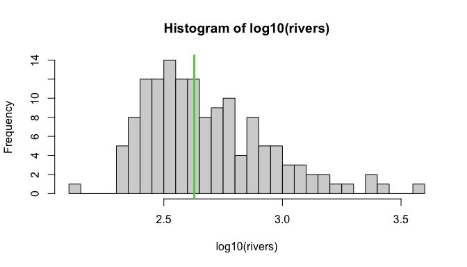

## Today

 - `if`
 - `else`
 - `ifelse()`

## Conditionals: `if`


``` r
if (logical argument){ # e.g., x > 1 or is.character(x)
  body
  }
```

 - logical statement must be **TRUE** to proceed...
 - otherwise nothing happens
 - To access help for `if` you have to quote it: `?"if"`


## Rivers data


``` r
data(rivers) #length of 141 "major" North American rivers (miles)
head(rivers)
```

```
## [1] 735 320 325 392 524 450
```

``` r
is.numeric(rivers)
```

```
## [1] TRUE
```

----


``` r
hist(log10(rivers), breaks=30)
abline(v=log10(median(rivers)),col=3, lwd=3)
```




## Conditionals: `if`


``` r
if (is.numeric(rivers)){
  median(rivers)
  }
```

```
## [1] 425
```

## Conditionals: `if`

You *can* put it all on one line, but...


``` r
if (is.numeric(rivers)){ median(rivers) }
```

```
## [1] 425
```


## Conditionals: `if`


``` r
if (!is.numeric(rivers)){
  median(rivers)
  }
```

 - `!` negates the logical
 - `is.numeric(rivers)` is `TRUE`, so `!is.numeric(rivers)` is `FALSE`
 - Nothing happens

## Conditionals: `else`

 - 2nd (optional) half of `if`  `else` statements


``` r
# Pass character object
x<-letters
if (is.numeric(x)){
  median(rivers)
  } else {
  class(x)
}
```

```
## [1] "character"
```

## Conditionals: `else`


``` r
# Pass numeric object
x<-1:10
if (is.numeric(x)){
  median(rivers)
  } else {
  class(x)
}
```

```
## [1] 425
```

## Key rule: `} else {` on the same line

The closing brace of `if` and the `else` keyword **must** be on the same line.


``` r
# WRONG -- R thinks the if statement is done
if (is.numeric(x)){
  median(rivers)
  }
else {
  class(x)
}
```


``` r
# RIGHT -- else follows the closing brace
if (is.numeric(x)){
  median(rivers)
  } else {
  class(x)
}
```

## `if`/`else` summary so far

| Feature | Detail |
|---|---|
| Test | Must evaluate to a **single** `TRUE` or `FALSE` |
| Body | Runs only when test is `TRUE` |
| `else` | Optional; runs when test is `FALSE` |
| Placement | `} else {` must be on the same line |
| Vectorized? | **No** -- works on a single logical value |

 - `if`/`else` is for **scalar** decisions
 - What if we need to apply a test to every element of a vector?

## Conditionals: `ifelse()`

Single element example


``` r
x<-TRUE
ifelse(x, 1, 2)
```

```
## [1] 1
```

 - `ifelse(test, TRUE , FALSE)`

## Conditionals: `ifelse()`

Long vector example


``` r
lowercase<-TRUE
ifelse(lowercase, letters, LETTERS)
```

```
## [1] "a"
```


``` r
lowercase<-c(TRUE, FALSE, TRUE, FALSE)
ifelse(lowercase, letters, LETTERS)
```

```
## [1] "a" "B" "c" "D"
```

 - Result of `ifelse` always the same shape (length usually) as the logical
 - Evaluates each element one-at-a-time

## Conditionals: `ifelse()`


``` r
river.bin<-ifelse(rivers > median(rivers), "Long", "Short")
river.bin[1:10] # Just look at the first 10
```

```
##  [1] "Long"  "Short" "Short" "Short" "Long"  "Long"  "Long"  "Short" "Long" 
## [10] "Long"
```

Make ordered factor:

``` r
river.bin<-factor(river.bin, 
  levels= rev(unique(river.bin)), ordered=T)
str(river.bin)
```

```
##  Ord.factor w/ 2 levels "Short"<"Long": 2 1 1 1 2 2 2 1 2 2 ...
```


## `if`/`else` vs `ifelse()` -- When to use which

| | `if` / `else` | `ifelse()` |
|---|---|---|
| Input | Single logical value | Vector of logicals |
| Output | Whatever the body returns | Vector same length as test |
| Use case | Control flow, branching | Reclassifying data, creating new columns |


``` r
# Scalar decision
if (is.numeric(rivers)) median(rivers)

# Vectorized classification
ifelse(rivers > median(rivers), "Long", "Short")
```


## Common use: combining `for` and `if`


``` r
for (each element in a vector){
  if(an element meets this condition){
    do this stuff
    } else {
    do this other stuff
    }
}
```


## Exercise

Using a `for` loop and an `if` statement, print only the elements of `par()` with more than three elements.

 1. Figure out the loop structure.
 2. Figure out the conditional (using `if`).

----

1.Figure out the loop structure.


``` r
for(i in par()){
    print(i)
}
```

This prints *every* element of `par()`. Now we need to filter.

----

2.Figure out the conditional (using `if`).


``` r
for(i in par()){
  if (length(i) >3){
    print(i)
  }
}
```

```
## [1] 0 1 0 1
## [1] 1.02 0.82 0.82 0.42
## [1] 5.1 4.1 4.1 2.1
## [1] 1 1 1 1
## [1] 0 0 0 0
## [1] 0 1 0 1
## [1] 0 0 0 0
## [1] 0.1171429 0.9400000 0.1700000 0.8633333
## [1] 0 1 0 1
```

## Summary

 > - `if (test){ body }` -- runs body when test is a single `TRUE`
 > - `else { body }` -- runs when test is `FALSE`; must follow `}` on the same line
 > - `ifelse(test, yes, no)` -- vectorized; applies to every element
 > - `if`/`else` for **control flow** (one decision)
 > - `ifelse()` for **data transformation** (many decisions at once)
