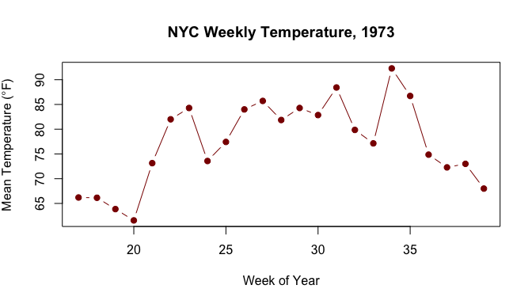
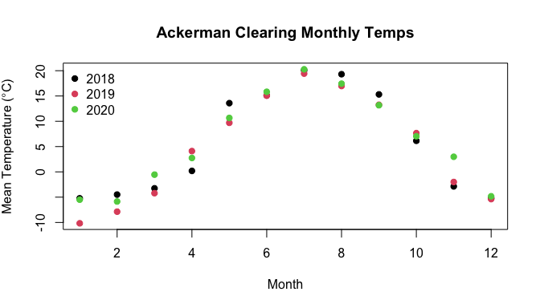

Today
----

 - `plyr::summarize()` and `ddply()`
 - class `Date` and date arithmetic
 - **Combining the two**: splitting and summarizing data by date-derived groups
 - Practice with Archer Creek Watershed data


The limitation of `aggregate()`
----

You already know `aggregate()`:


``` r
data(airquality)
aggregate(Temp ~ Month, airquality, FUN = mean)
```

```
##   Month     Temp
## 1     5 65.54839
## 2     6 79.10000
## 3     7 83.90323
## 4     8 83.96774
## 5     9 76.90000
```

But `aggregate()` only accepts **one** aggregation function at a time.


``` r
aggregate(Temp ~ Month, airquality, FUN = c(mean, sd))
```

```
## Error in `get()`:
## ! object 'FUN' of mode 'function' was not found
```

`plyr::summarize()`
----


``` r
library(plyr)
```

`summarize()` creates a new data frame from summary calculations. Unlike `aggregate()`, you can apply **multiple** functions at once.


``` r
summarize(airquality, 
  Avg = mean(Temp), 
  StdDev = sd(Temp),
  Med = median(Temp))
```

```
##        Avg  StdDev Med
## 1 77.88235 9.46527  79
```

 - You can name the output columns whatever you want

`plyr::summarize()`
----

Applied functions can reference objects created earlier in the same call:


``` r
summarize(airquality, 
  Avg = mean(Temp), 
  Med = median(Temp), 
  Dif = abs(Avg - Med))
```

```
##        Avg Med      Dif
## 1 77.88235  79 1.117647
```

 - What capability are we missing?

`ddply()`
----

 - Also in the `plyr` package
 - "Split data frame, apply function, and return results in a data frame." --- `?ddply`
 - Hadley Wickham (2011). "The Split-Apply-Combine Strategy for Data Analysis", *Journal of Statistical Software, 40(1), 1-29*
 - **d**ataframe *in*, **d**ataframe *out*, ap**ply**

`ddply()` arguments
----

 - **`.data`** = data frame to be processed
 - **`.variables`** = variables to split data frame by
    + a character vector
    + as `.()`-quoted variables
    + a formula
 - **`.fun`** = function to apply to each piece
 - **`...`** = arguments passed to `.fun` (e.g., `na.rm`)
    + in our case `.fun` is `summarize()`

`ddply()` in action
----


``` r
ddply(airquality, "Month", summarize,
  Avg.Temp = mean(Temp),
  Max.Ozone = max(Ozone, na.rm = TRUE))
```

```
##   Month Avg.Temp Max.Ozone
## 1     5 65.54839       115
## 2     6 79.10000        71
## 3     7 83.90323       135
## 4     8 83.96774       168
## 5     9 76.90000        96
```

 - Splits `airquality` by `Month`, applies `summarize()` to each piece, returns one data frame

`ddply()`: three ways to specify groups
----


``` r
ddply(airquality, "Month", ...)          # character
ddply(airquality, .(Month), ...)         # .() notation
ddply(airquality, ~Month, ...)           # formula
```

All three produce identical results.

 - **`.`** is a function that quotes variable names without evaluating them (see `?.`)
 - The formula interface uses `~` just like `aggregate()`

`ddply()`: multiple grouping variables
----


``` r
data(warpbreaks)
ddply(warpbreaks, .(wool, tension), summarize,
  Avg = mean(breaks),
  Med = median(breaks),
  Dif = abs(Avg - Med))
```

```
##   wool tension      Avg Med       Dif
## 1    A       L 44.55556  51 6.4444444
## 2    A       M 24.00000  21 3.0000000
## 3    A       H 24.55556  24 0.5555556
## 4    B       L 28.22222  29 0.7777778
## 5    B       M 28.77778  28 0.7777778
## 6    B       H 18.77778  17 1.7777778
```

class `Date`
====

class `Date`
----

 - Looks like a character; is *not* just a character
 - Dates are represented *internally* as the number of days since 1970-01-01
    + Earlier dates are assigned negative values
 - Many methods work only with `Date` objects (arithmetic, sorting, plotting)
 - No times in class `Date` (see `Date-Time` classes for that)
    + Highest level of resolution is a day

Conversion to class `Date`
----


``` r
x <- "03/25/2026"
class(x)
```

```
## [1] "character"
```


``` r
d <- as.Date(x, format = "%m/%d/%Y")
class(d)
```

```
## [1] "Date"
```

``` r
d
```

```
## [1] "2026-03-25"
```

 - `?strptime` for the full list of format codes

Common date format codes
----


``` r
?strptime
```

 - **%m** = month as decimal (01--12)
 - **%d** = day of month (01--31)
 - **%Y** = 4-digit year
 - **%y** = 2-digit year
 - **%j** = day of year (001--366)
 - **%A** = full weekday name
 - **%B** = full month name
 - **%b** = abbreviated month name

Alternate date notation
----

The separator and order don't matter --- just match the `format` argument to the input:


``` r
as.Date("03/25/2026", format = "%m/%d/%Y")
```

```
## [1] "2026-03-25"
```

``` r
as.Date("25-03-2026", format = "%d-%m-%Y")
```

```
## [1] "2026-03-25"
```

``` r
as.Date("2026|03|25", format = "%Y|%m|%d")
```

```
## [1] "2026-03-25"
```

 - The only *super* special character is **`%`**

Long-hand example
----


``` r
Echar <- "Wednesday March 25, 2026"
Edate <- as.Date(Echar, format = "%A %B %d, %Y")
Edate
```

```
## [1] "2026-03-25"
```

 - Enter separators (commas, spaces) verbatim in the format string

Conversion back to characters: `format()`
----


``` r
Edate <- as.Date("2026-03-25")
format(Edate, "%d-%m-%Y")
```

```
## [1] "25-03-2026"
```

``` r
format(Edate, "%B %Y")
```

```
## [1] "March 2026"
```

``` r
format(Edate, "This is day %j of %Y.")
```

```
## [1] "This is day 084 of 2026."
```

 - `format()` always returns a **character**, not a Date

Date arithmetic
----

Dates support arithmetic directly.


``` r
d1 <- as.Date("2014-10-01")
d2 <- as.Date("2026-03-25")
d2 - d1
```

```
## Time difference of 4193 days
```


``` r
d1 + 30
```

```
## [1] "2014-10-31"
```

 - Subtraction returns a `difftime` object
 - Addition/subtraction of integers adds/removes days

`difftime()`
----

For more control over units, use `difftime()`:


``` r
ss  <- as.Date("1962-09-27")  # Silent Spring published
ddt <- as.Date("1973-12-31")  # US DDT ban
difftime(ddt, ss, units = "weeks")
```

```
## Time difference of 587.5714 weeks
```

 - `units` accepts `"secs"`, `"mins"`, `"hours"`, `"days"`, `"weeks"`

Extracting info from Dates
----


``` r
d <- as.Date("2026-03-25")
weekdays(d)
```

```
## [1] "Wednesday"
```

``` r
months(d)
```

```
## [1] "March"
```

``` r
quarters(d)
```

```
## [1] "Q1"
```


``` r
format(d, "%j")  # Julian day
```

```
## [1] "084"
```

 - These functions return *characters*, not Dates

Extracting year and month with `format()`
----


``` r
format(d, "%Y")       # year as character
```

```
## [1] "2026"
```

``` r
as.numeric(format(d, "%m"))  # month as number
```

```
## [1] 3
```


Building a date column
----

The `airquality` dataset has `Month` and `Day` columns but no actual `Date` column. Let's build one.


``` r
# All observations are from 1973
airquality$Date <- as.Date(paste("1973", 
  airquality$Month, airquality$Day, sep = "-"))
head(airquality[, c("Month", "Day", "Date")])
```

```
##   Month Day       Date
## 1     5   1 1973-05-01
## 2     5   2 1973-05-02
## 3     5   3 1973-05-03
## 4     5   4 1973-05-04
## 5     5   5 1973-05-05
## 6     5   6 1973-05-06
```

 - `paste()` builds the date string; `as.Date()` parses it
 - Default format is `"%Y-%m-%d"` so no `format` argument needed

Why bother with a Date column?
----

Once you have a real `Date`, you can derive grouping variables you never had:


``` r
airquality$Weekday <- weekdays(airquality$Date)
airquality$Quarter <- quarters(airquality$Date)
airquality$Week    <- as.numeric(format(airquality$Date, "%U"))
```

Now we can split by weekday, quarter, or week number --- none of which existed in the raw data.

`ddply()` by weekday
----

Do ozone levels differ by day of the week? (Hint: industrial emissions tend to drop on weekends.)


``` r
ddply(airquality, "Weekday", summarize,
  N = sum(!is.na(Ozone)),
  Avg.Ozone = mean(Ozone, na.rm = TRUE),
  Avg.Temp  = mean(Temp))
```

```
##     Weekday  N Avg.Ozone Avg.Temp
## 1    Friday 15  31.60000 77.18182
## 2    Monday 16  37.43750 77.90476
## 3  Saturday 15  50.33333 77.63636
## 4    Sunday 18  44.38889 77.50000
## 5  Thursday 16  38.62500 78.59091
## 6   Tuesday 19  46.47368 79.13636
## 7 Wednesday 17  44.64706 77.22727
```

`ddply()` by weekday
----

The output is alphabetical. To order by day of week:


``` r
airquality$Weekday <- factor(airquality$Weekday,
  levels = c("Sunday","Monday","Tuesday","Wednesday",
             "Thursday","Friday","Saturday"),
  ordered = TRUE)

ozone_by_day <- ddply(airquality, "Weekday", summarize,
  N = sum(!is.na(Ozone)),
  Avg.Ozone = round(mean(Ozone, na.rm = TRUE), 1))
ozone_by_day
```

```
##     Weekday  N Avg.Ozone
## 1    Sunday 18      44.4
## 2    Monday 16      37.4
## 3   Tuesday 19      46.5
## 4 Wednesday 17      44.6
## 5  Thursday 16      38.6
## 6    Friday 15      31.6
## 7  Saturday 15      50.3
```

`ddply()` by week number
----

Summarize temperature by week of the year:


``` r
temp_by_week <- ddply(airquality, "Week", summarize,
  N = length(Temp),
  Avg.Temp = mean(Temp),
  Range = max(Temp) - min(Temp))
head(temp_by_week, 8)
```

```
##   Week N Avg.Temp Range
## 1   17 5 66.20000    18
## 2   18 7 66.14286    15
## 3   19 7 63.85714    11
## 4   20 7 61.57143    16
## 5   21 7 73.14286    24
## 6   22 7 82.00000    23
## 7   23 7 84.28571    16
## 8   24 7 73.57143    12
```

Plotting weekly summaries
----


``` r
plot(Avg.Temp ~ Week, data = temp_by_week, type = "b",
  pch = 19, col = "darkred",
  ylab = expression("Mean Temperature ("*degree*"F)"),
  xlab = "Week of Year",
  main = "NYC Weekly Temperature, 1973")
```

<!-- -->

 - `ddply()` produces a clean data frame ready for plotting

Multiple grouping variables
----

Split by **both** month and whether it is a weekend:


``` r
airquality$Weekend <- airquality$Weekday %in% 
  c("Saturday", "Sunday")

ddply(airquality, .(Month, Weekend), summarize,
  N = sum(!is.na(Ozone)),
  Avg.Ozone = round(mean(Ozone, na.rm = TRUE), 1))
```

```
##    Month Weekend  N Avg.Ozone
## 1      5   FALSE 21      24.7
## 2      5    TRUE  5      19.2
## 3      6   FALSE  5      19.4
## 4      6    TRUE  4      42.0
## 5      7   FALSE 19      56.5
## 6      7    TRUE  7      66.3
## 7      8   FALSE 19      58.3
## 8      8    TRUE  7      64.6
## 9      9   FALSE 19      28.3
## 10     9    TRUE 10      37.4
```

Using `ifelse()` to create custom groups
----

What if we want to group by the first vs. second half of each month?


``` r
airquality$Half <- ifelse(airquality$Day <= 15, 
  "1st Half", "2nd Half")

ddply(airquality, .(Month, Half), summarize,
  Avg.Wind = round(mean(Wind), 1),
  Avg.Temp = round(mean(Temp), 1))
```

```
##    Month     Half Avg.Wind Avg.Temp
## 1      5 1st Half     11.3     65.7
## 2      5 2nd Half     11.9     65.4
## 3      6 1st Half     10.8     82.6
## 4      6 2nd Half      9.7     75.6
## 5      7 1st Half      9.4     84.5
## 6      7 2nd Half      8.6     83.3
## 7      8 1st Half      8.9     85.1
## 8      8 2nd Half      8.7     82.9
## 9      9 1st Half      9.5     81.5
## 10     9 2nd Half     10.8     72.3
```

 - `ifelse()` creates the grouping variable; `ddply()` does the work

Practical example: Ackerman Clearing weather station
====

The data
----

Ackerman Clearing is a meteorological station in the Huntington Wildlife Forest, Adirondack Park. Daily observations include air temperature, precipitation, snow depth, and wind speed.


``` r
acw <- read.csv("ACW-met.csv")
str(acw)
```

```
## 'data.frame':	1058 obs. of  15 variables:
##  $ site           : chr  "Ackerman Clearing" "Ackerman Clearing" "Ackerman Clearing" "Ackerman Clearing" ...
##  $ site_abbr      : chr  "ackerman" "ackerman" "ackerman" "ackerman" ...
##  $ site_id        : int  1 1 1 1 1 1 1 1 1 1 ...
##  $ data_interval  : chr  "24 hour" "24 hour" "24 hour" "24 hour" ...
##  $ timestamp      : chr  "2018-01-18 00:00:00" "2018-01-19 00:00:00" "2018-01-20 00:00:00" "2018-01-21 00:00:00" ...
##  $ recnum         : int  497 498 499 500 501 502 503 504 505 506 ...
##  $ rain           : num  0 0 0 0.254 4.064 ...
##  $ snow_depth_mean: num  0.329 0.367 0.373 0.358 0.335 0.319 0.305 0.314 0.314 0.314 ...
##  $ snow_depth_min : num  0 0.343 0.361 0.349 0.317 0.317 0.292 0 0.293 0.307 ...
##  $ snow_depth_max : num  0.381 0.393 0.38 0.372 0.35 0.321 0.319 1.61 0.333 0.32 ...
##  $ air_temp_avg   : num  -9.62 -8.97 -7.077 -0.171 0.281 ...
##  $ air_temp_min   : num  -12.99 -12.1 -8.95 -3.21 -2.62 ...
##  $ air_temp_max   : num  -6.58 -6.26 -3.17 2.42 5.04 ...
##  $ windspeed_avg  : num  0.506 1.174 0.716 1.857 0.641 ...
##  $ windspeed_max  : num  2.24 3.54 3.42 5.38 3.25 ...
```

First look
----


``` r
head(acw[, c("timestamp","air_temp_avg","rain",
  "snow_depth_mean","windspeed_avg")])
```

```
##             timestamp air_temp_avg  rain snow_depth_mean windspeed_avg
## 1 2018-01-18 00:00:00       -9.620 0.000           0.329         0.506
## 2 2018-01-19 00:00:00       -8.970 0.000           0.367         1.174
## 3 2018-01-20 00:00:00       -7.077 0.000           0.373         0.716
## 4 2018-01-21 00:00:00       -0.171 0.254           0.358         1.857
## 5 2018-01-22 00:00:00        0.281 4.064           0.335         0.641
## 6 2018-01-23 00:00:00       -1.079 0.762           0.319         2.941
```

 - `timestamp` is a character --- we need to convert it to a `DateTime` 

You try...
----


``` r
head(acw)
?strptime
?DateTimeClasses
```

Converting the timestamp
----


``` r
class(acw$timestamp)
```

```
## [1] "character"
```

``` r
acw$Date <- as.Date(acw$timestamp, 
  format = "%Y-%m-%d %H:%M:%S")
class(acw$Date)
```

```
## [1] "Date"
```


``` r
range(acw$Date)
```

```
## [1] "2018-01-18" "2020-12-31"
```

 - About 3 years of daily data (2018--2020)

Deriving grouping variables from the Date
----


``` r
acw$Year    <- as.numeric(format(acw$Date, "%Y"))
acw$Month   <- as.numeric(format(acw$Date, "%m"))
acw$DOY     <- as.numeric(format(acw$Date, "%j"))
acw$Weekday <- weekdays(acw$Date)
```


``` r
head(acw[, c("Date","Year","Month","DOY")], 4)
```

```
##         Date Year Month DOY
## 1 2018-01-18 2018     1  18
## 2 2018-01-19 2018     1  19
## 3 2018-01-20 2018     1  20
## 4 2018-01-21 2018     1  21
```

Exercise
----

Use `ddply()` to give you mean, min, and max monthly temperatures by `Year`.

Monthly temperature by year
----


``` r
ddply(acw, .(Year, Month), plyr::summarize,
  Mean.Temp = round(mean(air_temp_avg), 1),
  Min.Temp  = round(min(air_temp_min), 1),
  Max.Temp  = round(max(air_temp_max), 1))
```

```
##    Year Month Mean.Temp Min.Temp Max.Temp
## 1  2018     1      -5.2    -19.5      6.1
## 2  2018     2      -4.5    -22.7     18.4
## 3  2018     3      -3.3    -21.0     12.1
## 4  2018     4       0.2    -14.0     18.6
## 5  2018     5      13.6     -1.4     28.2
## 6  2018     6      15.1      4.5     29.2
## 7  2018     7      20.1      6.6     33.1
## 8  2018     8      19.3      8.1     30.5
## 9  2018     9      15.3      2.4     30.9
## 10 2018    10       6.1     -7.5     25.8
## 11 2018    11      -2.9    -24.0     12.8
## 12 2018    12      -5.2    -16.4      9.9
## 13 2019     1     -10.2    -28.6      6.8
## 14 2019     2      -7.9    -24.0      8.1
## 15 2019     3      -4.2    -21.2     12.8
## 16 2019     4       4.1     -9.9     23.3
## 17 2019     5       9.7      0.2     28.7
## 18 2019     6      15.1      3.2     28.4
## 19 2019     7      19.4      8.7     30.2
## 20 2019     8      17.0      7.1     27.2
## 21 2019     9      13.3      1.4     26.4
## 22 2019    10       7.7     -1.9     23.5
## 23 2019    11      -2.0    -17.3     17.2
## 24 2019    12      -5.4    -25.0      9.1
## 25 2020     1      -5.5    -22.5     14.5
## 26 2020     2      -5.9    -25.4     11.3
## 27 2020     3      -0.5    -16.0     15.6
## 28 2020     4       2.7     -8.4     16.1
## 29 2020     5      10.7     -6.1     32.5
## 30 2020     6      15.8     -0.2     30.9
## 31 2020     7      20.3     11.8     32.1
## 32 2020     8      17.4      6.9     30.1
## 33 2020     9      13.2     -1.9     28.2
## 34 2020    10       7.0     -6.7     23.7
## 35 2020    11       3.0    -11.4     21.7
## 36 2020    12      -4.8    -18.2     12.8
```


Plotting monthly means
----


``` r
monthly <- ddply(acw, .(Year, Month), plyr::summarize,
  Mean.Temp = mean(air_temp_avg))

plot(Mean.Temp ~ Month, data = monthly, 
  col = as.factor(monthly$Year), pch = 19,
  ylab = expression("Mean Temperature ("*degree*"C)"),
  main = "Ackerman Clearing Monthly Temps")
legend("topleft", legend = unique(monthly$Year),
  col = 1:3, pch = 19, bty = "n")
```

Plotting monthly means
----

<!-- -->


`ddply()` vs. `dplyr`
----

`plyr` pioneered split-apply-combine in R. `dplyr` (also by Wickham) is its successor, built for speed and pipelines.

The core translation:


``` r
# plyr
ddply(df, .(var1, var2), summarize, ...)

# dplyr
df |> group_by(var1, var2) |> summarise(...)
```

 - `group_by()` replaces the `.variables` argument
 - The pipe (`|>`) replaces nesting
 - `summarise()` replaces both `.fun` and `...`

Side-by-side: simple grouping
----


``` r
library(dplyr)
```

```
## Warning: package 'dplyr' was built under R version 4.5.2
```


``` r
# plyr
ddply(acw, .(Year, Month), plyr::summarize,
  Mean.Temp = round(mean(air_temp_avg), 1),
  Min.Temp  = round(min(air_temp_min), 1),
  Max.Temp  = round(max(air_temp_max), 1))
```

```
##    Year Month Mean.Temp Min.Temp Max.Temp
## 1  2018     1      -5.2    -19.5      6.1
## 2  2018     2      -4.5    -22.7     18.4
## 3  2018     3      -3.3    -21.0     12.1
## 4  2018     4       0.2    -14.0     18.6
## 5  2018     5      13.6     -1.4     28.2
## 6  2018     6      15.1      4.5     29.2
## 7  2018     7      20.1      6.6     33.1
## 8  2018     8      19.3      8.1     30.5
## 9  2018     9      15.3      2.4     30.9
## 10 2018    10       6.1     -7.5     25.8
## 11 2018    11      -2.9    -24.0     12.8
## 12 2018    12      -5.2    -16.4      9.9
## 13 2019     1     -10.2    -28.6      6.8
## 14 2019     2      -7.9    -24.0      8.1
## 15 2019     3      -4.2    -21.2     12.8
## 16 2019     4       4.1     -9.9     23.3
## 17 2019     5       9.7      0.2     28.7
## 18 2019     6      15.1      3.2     28.4
## 19 2019     7      19.4      8.7     30.2
## 20 2019     8      17.0      7.1     27.2
## 21 2019     9      13.3      1.4     26.4
## 22 2019    10       7.7     -1.9     23.5
## 23 2019    11      -2.0    -17.3     17.2
## 24 2019    12      -5.4    -25.0      9.1
## 25 2020     1      -5.5    -22.5     14.5
## 26 2020     2      -5.9    -25.4     11.3
## 27 2020     3      -0.5    -16.0     15.6
## 28 2020     4       2.7     -8.4     16.1
## 29 2020     5      10.7     -6.1     32.5
## 30 2020     6      15.8     -0.2     30.9
## 31 2020     7      20.3     11.8     32.1
## 32 2020     8      17.4      6.9     30.1
## 33 2020     9      13.2     -1.9     28.2
## 34 2020    10       7.0     -6.7     23.7
## 35 2020    11       3.0    -11.4     21.7
## 36 2020    12      -4.8    -18.2     12.8
```

Side-by-side: simple grouping
----


``` r
# dplyr

acw |>
  group_by(Year, Month) |>
  summarise(
    Mean.Temp = round(mean(air_temp_avg), 1),
    Min.Temp  = round(min(air_temp_min), 1),
    Max.Temp  = round(max(air_temp_max), 1),
    .groups = "drop") #Drops persistent grouping. See `?dplyr_by`.
```

```
## # A tibble: 36 × 5
##     Year Month Mean.Temp Min.Temp Max.Temp
##    <dbl> <dbl>     <dbl>    <dbl>    <dbl>
##  1  2018     1      -5.2    -19.5      6.1
##  2  2018     2      -4.5    -22.7     18.4
##  3  2018     3      -3.3    -21       12.1
##  4  2018     4       0.2    -14       18.6
##  5  2018     5      13.6     -1.4     28.2
##  6  2018     6      15.1      4.5     29.2
##  7  2018     7      20.1      6.6     33.1
##  8  2018     8      19.3      8.1     30.5
##  9  2018     9      15.3      2.4     30.9
## 10  2018    10       6.1     -7.5     25.8
## # ℹ 26 more rows
```

 - Identical results; `dplyr` returns a `tibble` (prints slightly differently)

References
----

 - `?ddply`, `?summarize` (package `plyr`)
 - `?as.Date`, `?strptime`, `?difftime`, `?seq.Date`
 - Wickham, H. (2011). The Split-Apply-Combine Strategy for Data Analysis. *Journal of Statistical Software*, 40(1), 1--29.
 - Ackerman Clearing meteorological data, Huntington Wildlife Forest, Adirondack Park (adk-ltm.org)
 - `?airquality`
