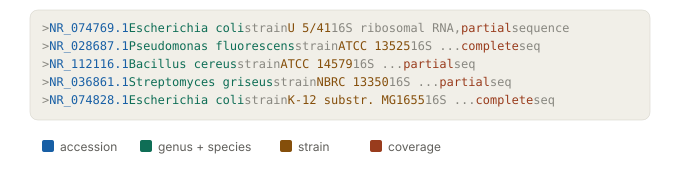
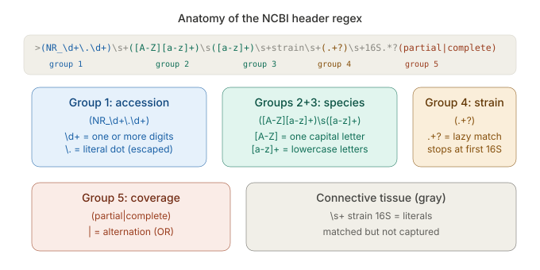

Today
----

 - Regular expressions: pattern matching in R
 - Extracting fields from messy text
 - Matching while *excluding*: negative lookaheads
 - Using Claude responsibly along the way

# Regex Basics

What is a regular expression?
----

A **pattern** that describes a set of strings.

Functions in base R that work with regular expressions:

 > - `grep()` -- find which elements match (returns indices or values)
 > - `grepl()` -- TRUE/FALSE for each element
 > - `regexpr()` -- position and length of first match
 > - `regmatches()` -- extract matched text (pair with `regexpr()` or `regexec()`)
 > - `regexec()` -- like `regexpr()` but also returns capture group positions
 > - `sub()` / `gsub()` -- find and replace (first / all)

Regex vocabulary
----

| Token | Meaning | Example |
|-------|---------|---------|
| `\\d` | any digit | `\\d+` matches "123" |
| `\\w` | word character (letter, digit, _) | `\\w+` matches "Plot_01" |
| `\\s` | whitespace | `\\s+` matches spaces, tabs |
| `.` | any character | `a.b` matches "a1b", "axb" |
| `+` | one or more | `\\d+` matches "1" or "999" |
| `*` | zero or more | `\\d*` matches "" or "42" |
| `?` | zero or one (optional) | `\\d?` matches "" or "7" |

Regex vocabulary (continued)
----

| Token | Meaning | Negation | Meaning |
|-------|---------|----------|---------|
| `\\d` | any digit (0-9) | `\\D` | any non-digit |
| `\\w` | word character (letter, digit, _) | `\\W` | any non-word character |
| `\\s` | whitespace (space, tab, newline) | `\\S` | any non-whitespace |
| `\\b` | word boundary | `\\B` | non-boundary position |


Regex vocabulary (continued)
----

| Token | Meaning | Example |
|-------|---------|---------|
| `{n}` | exactly n times | `\\d{4}` matches "2025" |
| `[A-Z]` | character class (range) | one uppercase letter |
| `[^abc]` | negated class | anything *except* a, b, c |
| `^` / `$` | start / end of string | `^>` matches ">" at start |
| `\\b` | word boundary | `\\bcoli\\b` won't match "colicin" |
| `\\.` | literal dot | escaped because `.` = "any char" |
| `(...)` | capture group | extract what's inside |

Regex vocabulary (continued)
----

| Token | Meaning | Example |
|-------|---------|---------|
| `(?!...)` | negative lookahead: "not followed by" | `(?!alba)` excludes alba |
| `(?=...)` | positive lookahead: "followed by" | `\\d+(?= cm)` matches digits before " cm" |
| `(?<=...)` | positive lookbehind: "preceded by" | `(?<=USGS )\\d+` matches digits after "USGS " |
| `(?<!...)` | negative lookbehind: "not preceded by" | `(?<!Dr\\.)\\s[A-Z]` skips titles |
| `.+?` | lazy quantifier: match as few as possible | `.+?\\s` stops at first space |
| `|` | alternation (OR) | `partial|complete` matches either |

**`perl = TRUE`** is required for lookaheads in R.

# Extracting from NCBI Headers

The data
----

Download `ncbi_16S_headers.txt` from the course website:


``` r
seqs <- readLines("ncbi_16S_headers.txt")
seqs[1:3]
```

```
## [1] ">NR_074769.1 Escherichia coli strain U 5/41 16S ribosomal RNA, partial sequence"            
## [2] ">NR_028687.1 Pseudomonas fluorescens strain ATCC 13525 16S ribosomal RNA, complete sequence"
## [3] ">NR_112116.1 Bacillus cereus strain ATCC 14579 16S ribosomal RNA, partial sequence"
```



Starting simple: `grep()` and `grepl()`
----

Which sequences are *Pseudomonas*?


``` r
grep("Pseudomonas", seqs)
```

```
## [1] 2 5 9
```

``` r
grep("Pseudomonas", seqs, value = TRUE)
```

```
## [1] ">NR_028687.1 Pseudomonas fluorescens strain ATCC 13525 16S ribosomal RNA, complete sequence"
## [2] ">NR_044946.1 Pseudomonas putida strain NBRC 14164 16S ribosomal RNA, partial sequence"      
## [3] ">NR_025530.1 Pseudomonas aeruginosa strain DSM 50071 16S ribosomal RNA, partial sequence"
```

`grep()` with `value = TRUE` returns the matching strings themselves.

`grepl()` returns a logical vector
----


``` r
grepl("partial", seqs)
```

```
##  [1]  TRUE FALSE  TRUE FALSE  TRUE FALSE  TRUE FALSE  TRUE FALSE
```

Useful for subsetting: `seqs[grepl("partial", seqs)]`


Extracting text: `regexpr()` + `regmatches()`
----

`grep()` tells you *which* strings match. To **extract** the matched text, pair `regexpr()` with `regmatches()`:


``` r
regmatches(seqs, regexpr("NR_\\d+\\.\\d+", seqs))
```

```
##  [1] "NR_074769.1" "NR_028687.1" "NR_112116.1" "NR_041263.1" "NR_044946.1"
##  [6] "NR_113266.1" "NR_036861.1" "NR_074828.1" "NR_025530.1" "NR_116594.1"
```

 - `regexpr()` finds the position and length of the first match
 - `regmatches()` uses that to pull out the matched substring
 - `NR_` is literal, `\\d+` is digits, `\\.` is a literal dot

`regexpr()` Only
----


``` r
regexpr("NR_\\d+\\.\\d+", seqs)
```

```
##  [1] 2 2 2 2 2 2 2 2 2 2
## attr(,"match.length")
##  [1] 11 11 11 11 11 11 11 11 11 11
## attr(,"index.type")
## [1] "chars"
## attr(,"useBytes")
## [1] TRUE
```

 - `regexpr()` finds the position and length of the first match

Extract genus and species
----


``` r
regmatches(seqs, regexpr("[A-Z][a-z]+\\s[a-z]+", seqs))
```

```
##  [1] "Escherichia coli"        "Pseudomonas fluorescens"
##  [3] "Bacillus cereus"         "Clostridium botulinum"  
##  [5] "Pseudomonas putida"      "Bacillus subtilis"      
##  [7] "Streptomyces griseus"    "Escherichia coli"       
##  [9] "Pseudomonas aeruginosa"  "Clostridium difficile"
```

 - `[A-Z][a-z]+` -- capitalized genus
 - `\\s` -- space
 - `[a-z]+` -- lowercase epithet

A taxonomic naming convention encoded as a pattern.

Your turn
----

Return *Pseudomonas* spp., but exclude *P. aeruginosa*. This is a challenging one...this is a *negative lookahead*.


``` r
grep("______", seqs, value = TRUE, perl = TRUE)
```

# Matching While Excluding

Negative lookahead: `(?!...)`
----


``` r
grep("Pseudomonas\\s+(?!aeruginosa\\b)\\w+", seqs, 
     value = TRUE, perl = TRUE)
```

```
## [1] ">NR_028687.1 Pseudomonas fluorescens strain ATCC 13525 16S ribosomal RNA, complete sequence"
## [2] ">NR_044946.1 Pseudomonas putida strain NBRC 14164 16S ribosomal RNA, partial sequence"
```

 > - `(?!aeruginosa\\b)` -- "not followed by aeruginosa"
 > - `\\b` -- word boundary prevents partial matches
 > - `perl = TRUE` -- required for lookaheads in base R

Exclude multiple species
----


``` r
grep("Pseudomonas\\s+(?!aeruginosa\\b|putida\\b)\\w+", seqs, 
     value = TRUE, perl = TRUE)
```

```
## [1] ">NR_028687.1 Pseudomonas fluorescens strain ATCC 13525 16S ribosomal RNA, complete sequence"
```

 - `|` inside the lookahead means OR
 - Stack as many exclusions as you need

Exclude entire lines
----


``` r
grep("^(?!.*Clostridium)", seqs, value = TRUE, perl = TRUE)
```

```
## [1] ">NR_074769.1 Escherichia coli strain U 5/41 16S ribosomal RNA, partial sequence"              
## [2] ">NR_028687.1 Pseudomonas fluorescens strain ATCC 13525 16S ribosomal RNA, complete sequence"  
## [3] ">NR_112116.1 Bacillus cereus strain ATCC 14579 16S ribosomal RNA, partial sequence"           
## [4] ">NR_044946.1 Pseudomonas putida strain NBRC 14164 16S ribosomal RNA, partial sequence"        
## [5] ">NR_113266.1 Bacillus subtilis strain JCM 1465 16S ribosomal RNA, complete sequence"          
## [6] ">NR_036861.1 Streptomyces griseus strain NBRC 13350 16S ribosomal RNA, partial sequence"      
## [7] ">NR_074828.1 Escherichia coli strain K-12 substr. MG1655 16S ribosomal RNA, complete sequence"
## [8] ">NR_025530.1 Pseudomonas aeruginosa strain DSM 50071 16S ribosomal RNA, partial sequence"
```

 - `^(?!.*Clostridium)` -- "from the start, never encounter 'Clostridium' anywhere on this line"

Exclude entire lines
----

Another option: postively match `Clostridium`, but use `invert = TRUE` to invert the selection.


``` r
grep("Clostridium", seqs, value = TRUE, perl = TRUE, invert = TRUE)
```

```
## [1] ">NR_074769.1 Escherichia coli strain U 5/41 16S ribosomal RNA, partial sequence"              
## [2] ">NR_028687.1 Pseudomonas fluorescens strain ATCC 13525 16S ribosomal RNA, complete sequence"  
## [3] ">NR_112116.1 Bacillus cereus strain ATCC 14579 16S ribosomal RNA, partial sequence"           
## [4] ">NR_044946.1 Pseudomonas putida strain NBRC 14164 16S ribosomal RNA, partial sequence"        
## [5] ">NR_113266.1 Bacillus subtilis strain JCM 1465 16S ribosomal RNA, complete sequence"          
## [6] ">NR_036861.1 Streptomyces griseus strain NBRC 13350 16S ribosomal RNA, partial sequence"      
## [7] ">NR_074828.1 Escherichia coli strain K-12 substr. MG1655 16S ribosomal RNA, complete sequence"
## [8] ">NR_025530.1 Pseudomonas aeruginosa strain DSM 50071 16S ribosomal RNA, partial sequence"
```

Exclude entire lines
----

An option that's much more restrictive (`fixed = TRUE`), but simpler to write.


``` r
grep("Clostridium", seqs, value = TRUE, fixed = TRUE, invert = TRUE)
```

```
## [1] ">NR_074769.1 Escherichia coli strain U 5/41 16S ribosomal RNA, partial sequence"              
## [2] ">NR_028687.1 Pseudomonas fluorescens strain ATCC 13525 16S ribosomal RNA, complete sequence"  
## [3] ">NR_112116.1 Bacillus cereus strain ATCC 14579 16S ribosomal RNA, partial sequence"           
## [4] ">NR_044946.1 Pseudomonas putida strain NBRC 14164 16S ribosomal RNA, partial sequence"        
## [5] ">NR_113266.1 Bacillus subtilis strain JCM 1465 16S ribosomal RNA, complete sequence"          
## [6] ">NR_036861.1 Streptomyces griseus strain NBRC 13350 16S ribosomal RNA, partial sequence"      
## [7] ">NR_074828.1 Escherichia coli strain K-12 substr. MG1655 16S ribosomal RNA, complete sequence"
## [8] ">NR_025530.1 Pseudomonas aeruginosa strain DSM 50071 16S ribosomal RNA, partial sequence"
```

 - Not working with regular expressions anymore. Verbatim matches only.

# Using Claude to Build a Harder Regex

A Harder Task
----

We want **five fields** from each header in a data frame: accession, genus, species, strain, and coverage.


That's harder than anything we've written so far. This is where Claude can help -- **if you use it well**.


Major Issues with AI (at least)
----

 - Cognitive offloading, leading to skill atrophy
 - Validity of output
 - Environmental footprint

----

| Problem | Finding | Source |
|---------|---------|--------|
| **Cognitive offloading** | LLM users underperformed no-tool users across neural and behavioral measures over 4 months | Kosmyna et al., 2025 |
| | Frequent AI use negatively correlated with critical thinking (n=666) | Gerlich, 2025 |
| **Invalid output** | 20% of LLM-recommended packages were fabricated across 576k code samples | UT/VT/OU joint study |
| | 29-45% of AI-generated code contains security vulnerabilities | diffray.ai, 2025 |
| **Energy footprint** | Typical query: ~0.3 Wh; reasoning models: 7-40 Wh (up to 100x more) | Epoch AI; Google; IEEE Spectrum, 2025 |
| | 2.5B queries/day = ~850 MWh/day, equivalent to ~29,000 US homes | IEEE Spectrum, 2025 |


Using AI well
----

| Problem | Best practice |
|---------|--------------|
| **Cognitive offloading** | Write your attempt before prompting |
| | Ask Claude to explain, not just write |
| **Invalid output** | Always run the code and check edge cases |
| | Include example data in your prompt |
| **Energy footprint** | One specific prompt beats five vague ones |
| | Use the smallest model that fits the task (i.e., Sonnet vs Opus)|


The prompt
----

<div style="background: var(--color-background-secondary, #f4f4f0); border-left: 4px solid #534AB7; padding: 12px 16px; margin: 8px 0; font-size: 90%; border-radius: 0 6px 6px 0;">
**To Claude (Sonnet 4.6):**

I have NCBI 16S rRNA FASTA headers like:

`>NR_074769.1 Escherichia coli strain U 5/41 16S ribosomal RNA, partial sequence`
`>NR_028687.1 Pseudomonas fluorescens strain ATCC 13525 16S ribosomal RNA, complete sequence`
`>NR_074828.1 Escherichia coli strain K-12 substr. MG1655 16S ribosomal RNA, complete sequence`

Write a regex with `regexec()` in base R that extracts: accession, genus, species, strain, and partial/complete. Explain each capture group. Show your energy usage for the chat in laptop run time (minutes).
</div>

Claude's response
----

<div style="background: var(--color-background-info, #f0eef8); border-left: 4px solid #534AB7; padding: 12px 16px; margin: 8px 0; font-size: 82%; border-radius: 0 6px 6px 0;">
Here's a regex with five capture groups:

`">(NR_\\d+\\.\\d+)\\s+([A-Z][a-z]+)\\s([a-z]+)\\s+strain\\s+(.+?)\\s+16S.*?(partial|complete)"`

- Group 1 `(NR_\\d+\\.\\d+)` -- accession with version
- Group 2 `([A-Z][a-z]+)` -- genus (capitalized)
- Group 3 `([a-z]+)` -- species epithet (lowercase)
- Group 4 `(.+?)` -- strain, lazy match to stop at first "16S"
- Group 5 `(partial|complete)` -- sequence coverage

Use `regexec()` with `perl = TRUE`, then `regmatches()` to extract.

Energy: ~0.3 Wh for this query. At 7W for a laptop screen, that's about 2.6 minutes of screen time.
</div>

----



`regexec()` + `regmatches()`
----

`regexec()` does what `regexpr()` does but **also returns capture group positions**. Paired with `regmatches()`, you get the full match *and* each group:


``` r
pattern <- paste0(
  ">(NR_\\d+\\.\\d+)",        # group 1: accession
  "\\s+([A-Z][a-z]+)",        # group 2: genus
  "\\s([a-z]+)",              # group 3: species
  "\\s+strain\\s+(.+?)",     # group 4: strain (lazy)
  "\\s+16S.*?",              # skip to coverage
  "(partial|complete)"        # group 5: coverage
)
m <- regmatches(seqs, regexec(pattern, seqs, perl = TRUE))
m[[1]]
```

```
## [1] ">NR_074769.1 Escherichia coli strain U 5/41 16S ribosomal RNA, partial"
## [2] "NR_074769.1"                                                           
## [3] "Escherichia"                                                           
## [4] "coli"                                                                  
## [5] "U 5/41"                                                                
## [6] "partial"
```

`regexec()` Only
----


``` r
regexec(pattern, seqs, perl = TRUE)
```

```
## [[1]]
## [1]  1  2 14 26 38 64
## attr(,"match.length")
## [1] 70 11 11  4  6  7
## attr(,"useBytes")
## [1] TRUE
## attr(,"index.type")
## [1] "chars"
## 
## [[2]]
## [1]  1  2 14 26 45 75
## attr(,"match.length")
## [1] 82 11 11 11 10  8
## attr(,"useBytes")
## [1] TRUE
## attr(,"index.type")
## [1] "chars"
## 
## [[3]]
## [1]  1  2 14 23 37 67
## attr(,"match.length")
## [1] 73 11  8  6 10  7
## attr(,"useBytes")
## [1] TRUE
## attr(,"index.type")
## [1] "chars"
## 
## [[4]]
## [1]  1  2 14 26 43 73
## attr(,"match.length")
## [1] 80 11 11  9 10  8
## attr(,"useBytes")
## [1] TRUE
## attr(,"index.type")
## [1] "chars"
## 
## [[5]]
## [1]  1  2 14 26 40 70
## attr(,"match.length")
## [1] 76 11 11  6 10  7
## attr(,"useBytes")
## [1] TRUE
## attr(,"index.type")
## [1] "chars"
## 
## [[6]]
## [1]  1  2 14 23 39 67
## attr(,"match.length")
## [1] 74 11  8  8  8  8
## attr(,"useBytes")
## [1] TRUE
## attr(,"index.type")
## [1] "chars"
## 
## [[7]]
## [1]  1  2 14 27 42 72
## attr(,"match.length")
## [1] 78 11 12  7 10  7
## attr(,"useBytes")
## [1] TRUE
## attr(,"index.type")
## [1] "chars"
## 
## [[8]]
## [1]  1  2 14 26 38 77
## attr(,"match.length")
## [1] 84 11 11  4 19  8
## attr(,"useBytes")
## [1] TRUE
## attr(,"index.type")
## [1] "chars"
## 
## [[9]]
## [1]  1  2 14 26 44 73
## attr(,"match.length")
## [1] 79 11 11 10  9  7
## attr(,"useBytes")
## [1] TRUE
## attr(,"index.type")
## [1] "chars"
## 
## [[10]]
## [1]  1  2 14 26 43 72
## attr(,"match.length")
## [1] 79 11 11  9  9  8
## attr(,"useBytes")
## [1] TRUE
## attr(,"index.type")
## [1] "chars"
```

Building a data frame from the matches
----

`m` is a list of character vectors. Each vector has the full match at `[1]` and capture groups at `[2:6]`. To get a data frame:


``` r
result <- do.call(rbind, lapply(m, function(x) x[2:6]))
result <- as.data.frame(result, stringsAsFactors = FALSE)
names(result) <- c("accession", "genus", "species", 
                    "strain", "coverage")
```

Unpacking that line
----


``` r
do.call(rbind, lapply(m, function(x) x[2:6]))
```

 > - `lapply(m, function(x) x[2:6])` -- loop over the list, pull out positions 2--6 (the five capture groups) from each element
 > - `do.call(rbind, ...)` -- take that list and stack each element as a row in a matrix
 > - Same as `rbind(m[[1]][2:6], m[[2]][2:6], ...)` but without all that typing

Result
----


``` r
result
```

```
##      accession        genus     species              strain coverage
## 1  NR_074769.1  Escherichia        coli              U 5/41  partial
## 2  NR_028687.1  Pseudomonas fluorescens          ATCC 13525 complete
## 3  NR_112116.1     Bacillus      cereus          ATCC 14579  partial
## 4  NR_041263.1  Clostridium   botulinum          ATCC 25763 complete
## 5  NR_044946.1  Pseudomonas      putida          NBRC 14164  partial
## 6  NR_113266.1     Bacillus    subtilis            JCM 1465 complete
## 7  NR_036861.1 Streptomyces     griseus          NBRC 13350  partial
## 8  NR_074828.1  Escherichia        coli K-12 substr. MG1655 complete
## 9  NR_025530.1  Pseudomonas  aeruginosa           DSM 50071  partial
## 10 NR_116594.1  Clostridium   difficile           ATCC 9689 complete
```

# Closing

Considerations for Regular Expressions
----

 - All dependent on how well you know your data
 - Formatting standards are crucial 
 - Testing your regex is crucial
 - If possible, use data frames with one variable assigned to one column

AI Energy Usage (approximate)
----

 > - A typical Claude query: ~0.3 Wh (Epoch AI; Google, 2025)
 > - Complex reasoning queries: 7--40 Wh
 > - Five sloppy prompts = 5x the energy of one good one
 > - Asking Claude to develop the regex took an equivalent of roughly 5 min of laptop power including generating a diagram showing me how it works. 
 >      + Is that worth it? It would have taken me maybe *2 hours* on my laptop.
 >      + What about water usage for cooling? Other unaccounted for environmental impacts?

# Take-home Exercise

USGS streamgage data
----

Download `usgs_gauges.txt`. Each line looks like:

<small>
`USGS 04240105 Onondaga Creek at Dorwin Ave., Syracuse NY  lat:43.0281 long:-76.1522 drain_area_sqmi:82.2`
</small>

Extract two features into a data frame:

 1. **station number** (e.g., "04240105")
 2. **drainage area** (e.g., 82.2)

Hints
----

 - `readLines()` to load
 - Station number: pattern right after "USGS "
 - Drainage area: pattern after "drain_area_sqmi:"
 - `regmatches()` + `regexpr()` for each

**Apply the three rules**: try it yourself first, run and check, craft one good prompt if you ask Claude.

Solution (for next class)
----


 - `(?<=USGS )` -- **positive lookbehind**: match digits *after* "USGS "
 - Lookbehinds check what comes *before* the match
