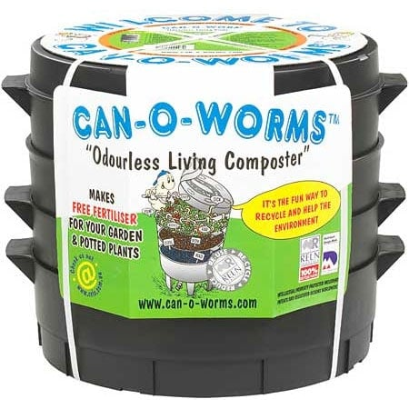
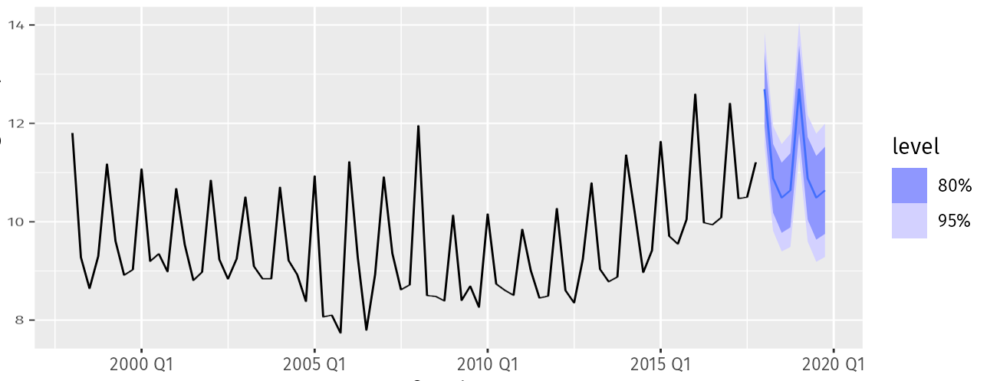
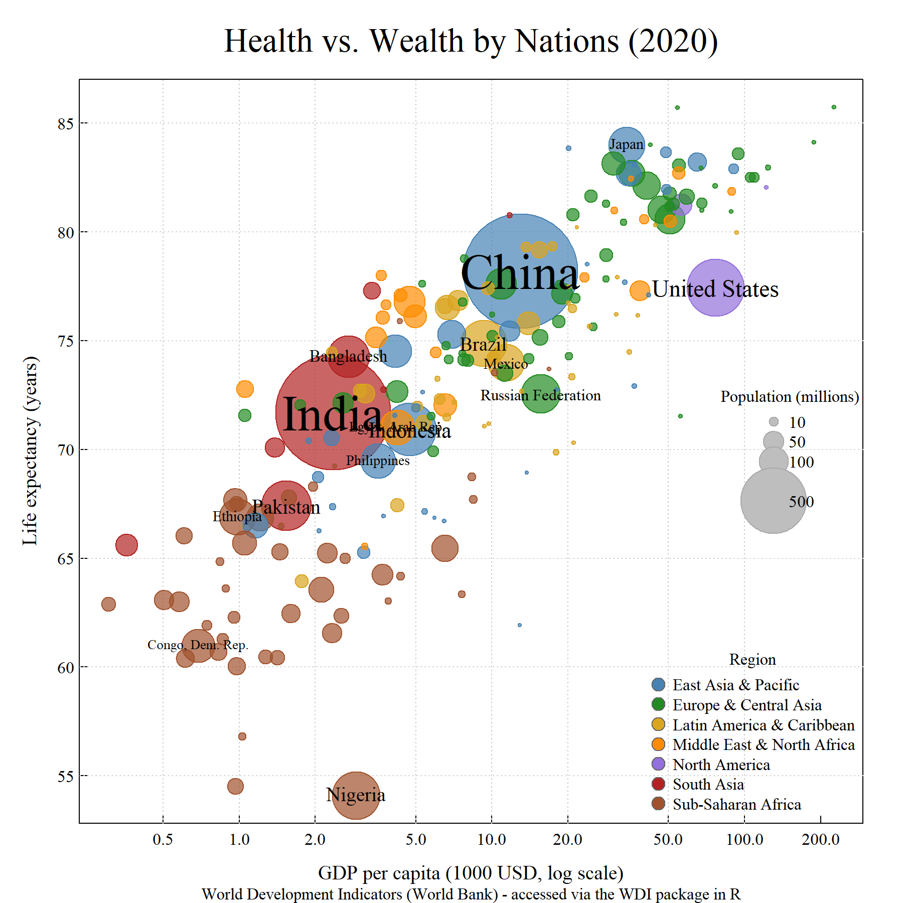

class: inverse

```{r setup, include=FALSE}
knitr::opts_chunk$set(echo = TRUE, warning = FALSE, message = FALSE,
                      fig.align = "center", dpi = 200)
```

```{r eval = FALSE, echo = FALSE}
xaringan::inf_mr()
```


# Last week in re. Shiny apps...

.pull-left[

.Large[
> *"You will save yourself **A LOT** of time — if you let an LLM (like `Claude.ai`) help you out."*

]]
--
.pull-right[


]

---

## Advantages & Risks

.pull-left[
### Advantages
- **Efficiency** — tasks that took hours take minutes

- **Multiplicative force** — you direct; AI executes

- **Lowers the barrier** to trying fancy stuff, understanding techniques, 

- **"Rubber Duck** — explaining your problem clarifies the problem

- **Much Faster than Googling** - for complex, multi-step coding tasks
]


.pull-right[
### Risks
- **Outsourcing understanding** — code you can't explain is code you can't maintain or debug

- **Hallucination** — Claude occasionally invents function arguments or packages that don't exist

- **Over-engineering** — asked for a hammer, got a Swiss army knife

- **Not learning** — copy-paste without engagement stunts development

- **Environmental cost** — esp. wrt to energy

- **Social costs** - (related: ***Sycophancy***)
]


---
class: large 

## Core Takeaway

> .Large[For R coding, the **advantages outweigh the risks** — *if done correctly*.]


.pull-left.large[
AI is a **collaborator**, not a **ghostwriter**.

- It can provides rough drafts

- It can help refine 

- It can help check


But It **NEVER** provides a final product. 
]


.pull-right.large[
**Use it for productivity** and **learning**.  
Understand [the code] it is providing  

  - to make sure its correct
  
  - to fix it 
  
  - to "own"it

]


---
class: large, inverse, middle, center


# Which Tool To Use? 

---

## Choosing the Right Tool

.Large[
Use **[Claude.ai](https://claude.ai)** through Syracuse University's institutional access.
]

- Better privacy guarantees — **institutional data** not used to train models 

  -  STILL: don't paste / upload sensitive, unpublished, or proprietary data into consumer tools
  - (or - just - don't upload any data)
  
- More capacity | more powerful models

- "Free" for you

---
## Multiple Claude Models


#### Model choice matters:

| Model | Use when... |
|---|---|
| **Haiku** | Simple, repetitive tasks — reformatting, quick lookups |
| **Sonnet** | Almost everything else — this is your default |
| **Opus** | Genuinely complex reasoning tasks — rarely needed for R coding |

<br><br>

> Sonnet will easily handle 95% of R coding tasks. 
> 
> Opus is not "better Sonnet" for most purposes — it's slower, costlier, and more likely to over-confidently barge down crazy rabbit-holes.


---
class: inverse, middle, center

# Environmental Costs

---

## How Much Energy Does This Use?

.pull-left[
A rough but useful framework:

| Action | Energy |
|---|---|
| Single query / short response | ~1 Wh |
| Generating a markdown / text doc | ~5 Wh |
| Generating a Word / PDF / complex doc | ~25 Wh |

Model matters too:
- **Haiku** → divide by 3
- **Sonnet** → baseline
- **Opus** → multiply by 3
]

.pull-right[
To make it tangible: compare to a **1500W space heater**

$$\text{heater seconds} = \frac{\text{energy (Wh)} \times 3600}{1500}$$

So 1 Wh ≈ **2.4 seconds** of space heater.

A typical coding session with Claude (10–15 exchanges + a few file generations):

~25 Wh → about **1 minute** of space heater.

Or: ~40 minutes powering a laptop screen.

]

> Dr. Green has Claude compute this approximate environmental cost at the end of each query.  Great idea.

---

## Is It Worth It?

.pull-left[
**Compare to the alternative:**

A (non-AI) Google session to figure out, e.g., how to add a regression line with R² to a `ggplot` scatter plot:

- 4–6 searches
- Reading 3–4 Stack Overflow threads
- Each Google search ≈ 0.3 Wh
- Each page load ≈ 0.5–2 Wh
- Total: easily *15 Wh** — *plus potentially HOURS of your time*

**Note - it is actually very hard to stop Google from using AI anways when it searches**

A single well-formed Claude query: **~1–3 Wh**, answered in seconds.
]

.pull-right[
**The environmental math usually favors Claude** — *especially for complex tasks.*

<br>

The real cost isn't the energy per query.  

It's **unnecessary queries**: asking Claude to do things you already know, using Opus when Sonnet suffices, regenerating output because the prompt was vague.

> **Good prompting = fewer queries = lower footprint.**
]

---
class: inverse, middle, center

# Best Practices

---


.pull-left[
### Prompt Structure

**1. Context** — what you have

> *"Here is an R script that plots GDP vs. life expectancy using base R graphics: [paste code]"*

**2. Task** — what you want

> *"Convert this to ggplot2, preserving: log x-axis, bubble size proportional to population, colors by region, two legends."*

**3. Constraints** — how you want it

> *"Use named color vectors. Explain each new ggplot layer."*
]

.pull-right[
**Avoid:**

- Vagueness: *"make it better"*
- Asking for too much at once
- Not specifying constraints

**Personally:**

- I don't thank / please Claude.ai, any more than I thank any other fitted linear modeling for providing a forecasting prediction



- Keep queries short - (grammar secondary to content)
- Ask it to ask follow-ups - so it doesn't head somewhere crazy.  
]

---

## Iterating & Verifying

Think of it as **pair programming**, not **outsourcing**:

1. **Start small** — ask for one feature at a time

2. **Run every response** before asking for the next change

3. **Read what it produces** — don't just copy-paste

4. **Version your code** — before each Claude edit, save `app_v1.R`, `app_v2.R`, etc.

5. **Ask it to explain** — *"explain what the `scale_size_area()` call is doing"*

6. **Push back** — *"that introduced a bug: [paste error]. Fix only that."*

---

## When Things Break

Claude will sometimes produce code that doesn't run. Standard debugging loop:

```
1. Run the code → get error
2. Paste back to Claude: "Here is the error: [paste].  
   Here is the current code: [paste]. Fix it."
3. Read the fix — understand what changed
4. Run again
```

**Red flags to watch for:**

- Functions or arguments you don't recognize → check with `?functionname`
- Claude inventing a package that doesn't exist → `install.packages()` will fail
- Code that runs but produces wrong output — harder to catch, requires *you* to know what "correct" looks like

.center.red.Large[**You are the quality control.**]

---
class: inverse, middle, center

# Examples

---

## Example 1: Extending the Old Faithful Shiny App

**The setup:** You have `app5.R` — two histogram tabs, color and bin controls.
.pull-left-70[
**The prompt:**

> Here is a Shiny app [*paste app5.R*]. Add:
>
> 1. Third tab with a scatter plot of eruptions vs. waiting time, with a fitted regression line and R² value displayed on the plot
>
> 2. Fourth tab with an interactive DT data table of the raw faithful data
>
> 3. Download button in the sidebar for the currently active histogram as a PNG
>
> Explain how / where features added."
]

.pull-right-30[


]

---

## Example 2: Base R → ggplot2

.pull-left[
What it has:
- Log x-axis
- Bubble size ∝ population
- Named color vector by region  
- Semi-transparent fills
- Two legends (region + population scale)
- Country labels for large nations
- Custom gridlines, fonts, margins
]


.pull-right[

]

---


## Example 2: The Prompt


.pull-left[
> Convert to ggplot.  [[*paste code*]]

**The broader point:**

This translation would take an experienced ggplot user 1–2 hours of Stack Overflow.  

Claude does it in ~3 Wh — less energy than a single complex Google session.  

**But you still need to understand the result.**

]

.pull-right[

```{r, echo = FALSE}
library(ggplot2)
library(ggrepel)
library(scales)

wdi <- read.csv("WDI.csv")
wdi <- wdi[order(wdi$Population, decreasing = TRUE), ]
wdi$region <- factor(wdi$region)

cols <- c("East Asia & Pacific"        = "steelblue",
          "Europe & Central Asia"      = "forestgreen",
          "Latin America & Caribbean"  = "goldenrod",
          "Middle East & North Africa" = "darkorange",
          "North America"              = "mediumpurple",
          "South Asia"                 = "firebrick",
          "Sub-Saharan Africa"         = "sienna")

wdi$GDP_k <- wdi$GDP / 1e3

ggplot(wdi, aes(x = GDP_k, y = LifeExp)) +
  geom_point(aes(size = Population, fill = region),
             shape = 21, color = "grey40", alpha = 0.7) +
  geom_text_repel(data = subset(wdi, Population > 1e8),
                  aes(label = country, size = Population / 5e8),
                  show.legend = FALSE, max.overlaps = 20) +
  scale_x_log10(breaks = c(0.5, 1, 2, 5, 10, 20, 50, 100),
                labels = c("0.5","1","2","5","10","20","50","100")) +
  scale_fill_manual(values = cols, name = "Region") +
  scale_size_area(max_size = 20, name = "Population (millions)",
                  breaks = c(10, 50, 100, 500) * 1e6,
                  labels = c("10", "50", "100", "500")) +
  labs(title = "Health vs. Wealth by Nations (2020)",
       subtitle = "World Development Indicators (World Bank) - accessed via the WDI package in R",
       x = "GDP per capita (1000 USD, log scale)",
       y = "Life expectancy (years)") +
 theme(panel.grid.major = element_line(color = "grey80", linetype = "dotted"),
        panel.grid.minor = element_blank()) +
  theme_minimal(base_family = "serif") +
  theme(axis.text = element_text(size = 10),
        axis.title = element_text(size = 12),
        plot.title = element_text(size = 16),
        legend.position = "right")
```


]


---
class: inverse, middle

# Summary

.Large[
- AI is a **multiplier** — it amplifies what you already know
- Use `Claude.ai` with institutional account
- **Sonnet is almost always enough** — match the model to the task
- **Good prompts** = context + task + constraints + full code
- **Iterate small** — one feature at a time, run every response
- **You are the QC** — understand what it produces, or you can't fix it
- **Environmental cost is real but manageable** — good prompting is also good ecology
]


