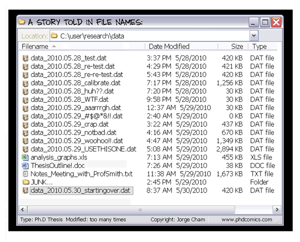
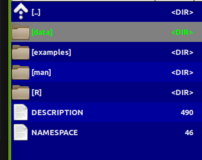
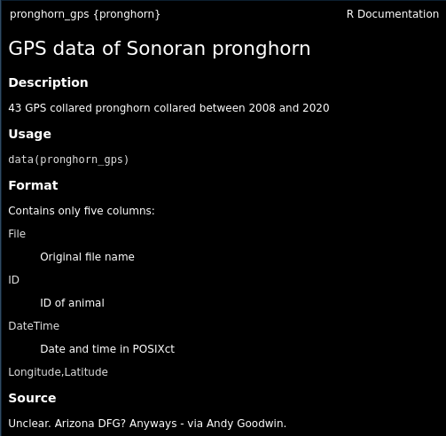

class: inverse, center, middle

```{css, echo = FALSE}
.remark-slide-content {
  font-size: 20px;
}
```

```{r setup, include=FALSE}
knitr::opts_chunk$set(echo = TRUE, warning = FALSE, message = FALSE,
                      fig.align = "center", dpi = 200, class.output="footnotesize")
```

```{r cache = FALSE, echo = FALSE}
pars <- function(...){
  par(mar = c(3,3,2,2), bty = "l", mgp = c(1.5,.25,0),
      tck = 0.01, cex.lab = 1.2, ...)
}
```

```{r xaringan-extras, echo=FALSE}
xaringanExtra::use_scribble()
xaringanExtra::use_tile_view()
```
```{r eval = FALSE, echo = FALSE}
xaringan::inf_mr()
```


# Why build an R package?

---


.pull-left-40[
## Why!?

- Conquer and permanently tame confusing folder soups of data and R scripts

- Make code:
  - **ultra-compact**
  - **well-documented**
  - **highly replicable**

- Dramatically shorten time to get back on track

ultimately:

- (truly) publish tools and methods
]

.pull-right-60[
<br><br>

]


---
## Sonoran Pronghorn

.pull-left-60[


]
.pull-right-40[

]

---

## Processing before:

(this is a small snippet of a data processing nightmare)
.pull-left.small[

```{r, eval = FALSE}
gps.dir <- "data/SonoranPronghorn/Locations_GPSCollarTelemetry/"
pronghorn <- read.csv(paste0(gps.dir, f.v1[i])) %>% 
  processRaw_v1(id = id.v1[i], filename = f.v1[i])

pronghorn.sf <- st_as_sf(df.raw, 
    coords = c("ECEF_X..m.", "ECEF_Y..m.", "ECEF_Z..m.")) %>% 
  st_set_crs(4978) %>% st_transform(4326) %>% st_coordinates

with(df.raw, 
     data.frame(
       File     = filename, 
       ID       = CollarID,
       DateTime = mdy_hms(paste(UTC_Date, UTC_Time)),
       Latitude = ll[,"Y"], 
       Longitude = ll[,"X"],
       Elevation = ll[,"Z"])) %>% 
  subset(!is.na(DateTime))
```
]
.pull-right.small[
```{r, eval = FALSE}
# important step, need to convert from windows-1252 to UTF8 in order to read:
#  find *.csv -exec sh -c "iconv -f Windows-1252 -t UTF8 {} > {}v2" \; 
  
  f.v2 <- f[grepl("GPS_Collar", f)]
 
pronghorn_gps_v2 <- data.frame()
  for(i in 1:length(f.v2)){
    if(f.v2[i] != badf){
      print(f.v2[i])
      df <- read.csv(paste0(gps.dir,"encoded/",f.v2[i])) %>% 
        subset(!is.na(ECEF_X..m.)) %>% 
        processRaw_v2(filename = f.v2[i])
      pronghorn_gps_v2 <- rbind(pronghorn_gps_v2, df)
    }
  }
```
]

---

## Processing now

```{r}
require(pronghorn)
data("pronghorn_gps")
head(pronghorn_gps)
```

---
class: inverse, center, middle

# R Package Structure

---

## R package structure

.pull-left[

]

.pull-right.large[

- `R/` folder contains code

- `data/` folder contains data — as `.rda`

- `man/` folder contains documentation

- `DESCRIPTION` — essential info

- `NAMESPACE` — complicated (*mainly automated*)
]

---

## `DESCRIPTION` file

```
Package: pronghorn
Type: Package
Title: Sonoran pronghorn analysis project
Version: 0.1.0
Author: Elie, Nicki, others
Maintainer: The package maintainer <yourself@somewhere.net>
Description: The pronghorn package is a PRIVATE collaborative package 
             containing processed data, code and results for analysis 
             of Sonoran pronghorn.
License: PRIVATE
Encoding: UTF-8
LazyData: false
Depends: lubridate, magrittr, plyr, dplyr, ggplot2, ggpubr, sp, sf, stringr
Suggests: mapview 
RoxygenNote: 7.1.1
```

---

## Documentation

.pull-left[

]

.pull-right[
R man file (auto-generated)
```
\docType{data}
\name{pronghorn_gps}
\title{GPS data of Sonoran pronghorn}
\format{
  Contains only five columns:
  \describe{
    \item{File}{Original file name}
    \item{ID}{ID of animal}
    \item{DateTime}{Date and time in POSIXct}
    \item{Longitude,Latitude}{}
  }
}
\description{
  43 GPS collared pronghorn collared 
  between 2008 and 2020
}
```
]

---

## Using Roxygen

Streamlines documentation by turning "comments" into help files.  

.small[
```{r, eval = FALSE}
#' GPS data of Sonoran pronghorn
#'
#' 43 GPS collared pronghorn collared between 2008 and 2020
#' 
#' @usage data(pronghorn_gps)
#'
#' @format Contains only five columns:
#' \describe{
#'   \item{File}{Original file name}
#'   \item{ID}{ID of animal}
#'   \item{DateTime}{Date and time in POSIXct}
#'   \item{Longitude,Latitude}{}
#' }
#' @example examples/pronghorn_gps_examples.R
#' @source Arizona DFG, via Andy Goodwin. 
#' @keywords data
```
]

> You must install `roxygen2` package and configure build settings (once) to automatically build help files


---
class: inverse, center, middle

# Building a Package: Step by Step

---
class: large

## How to create a package

1. By hand

2. `base::package.skeleton()`

3. `usethis::create_package()` ← **recommended**

4. Build directly off an existing GitHub project

---

## The example: *Paramecium* competition

.pull-left.large[

We'll take scripts from [`fittingfunctions.R`](content/fittingfunctions.R) and datasets [`single.csv`](content/single.csv) and [`mixture.csv`](content/mixture.csv) and build a package called `combinator`.

It fits a logistic growth model and explores a competition model from Gause's famous 1930s experiment.
]

.pull-right[
```{r, echo = FALSE, out.width = "100%"}
source("content/fittingfunctions.R")
single  <- read.csv("content/single.csv")
mixture <- read.csv("content/mixture.csv")
pars()
plot(aurelia ~ Day, data = single, col = 1, type = "o")
lines(caudatum ~ Day, data = single, col = 2, type = "o")
legend("bottomright", legend = c("aurelia", "caudatum"), 
       col = 1:2, pch = 1, lty = 1)
fit1 <- fitLogistic(single, y = "aurelia",  time = "Day", 1, 200, .75)
fit2 <- fitLogistic(single, y = "caudatum", time = "Day", 1, 200, .75)
linesLogistic(fit1, lwd = 3)
linesLogistic(fit2, col = 2, lwd = 3)
```
]

---

## Step I: Build a skeleton (empty) package

.pull-left[
Know your working directory first!

```{r}
getwd()
```

Windows users — install Rtools first:
```{r eval = FALSE}
installR::install.Rtools()
```

Create the package skeleton:
```{r, eval = FALSE}
require(usethis)
create_package("combinator")
```
]

.pull-right[
Output:
```
Package: combinator
Title: What the Package Does
Version: 0.0.0.9000
Authors@R (parsed):
  * First Last <first.last@example.com> [aut, cre]
Description: What the package does.
License: use_mit_license() or friends
Encoding: UTF-8
LazyData: true
RoxygenNote: 7.1.0
```

Creates a `combinator/` folder with correct structure and opens a new RStudio project.
]

---

## Step II: Edit the DESCRIPTION file

Open and fill in name, license, contact, etc.

```{r, eval = FALSE}
use_gpl3_license("combinator")
```

```
✓ Setting active project to '.../combinator'
✓ Setting License field in DESCRIPTION to 'GPL-3'
✓ Writing 'LICENSE.md'
✓ Adding '^LICENSE\.md$' to '.Rbuildignore'
```

For a personal-use package, none of this is critical — but good practice.

---

## Step III: Save some data

```{r, eval = FALSE}
single  <- read.csv("content/single.csv")
mixture <- read.csv("content/mixture.csv")
```

Create a `data/` directory and save with `.rda` extension:

```{r, eval = FALSE}
save(single,  file = "data/single.rda")
save(mixture, file = "data/mixture.rda")
```

These can always be loaded independently:

```{r, eval = FALSE}
load("data/single.rda")
load("data/mixture.rda")
```

---

## Step IV: Save some code

.pull-left-40[
Take these three functions and save each into a **separate** file in `R/`:

- `logistic.R`
- `fitLogistic.R`
- `linesLogistic.R`
]

.pull-right-60[
```{r}
logistic <- function(x, N0, K, r0){ 
  K / (1 + ((K - N0) / N0) * exp(-r0 * x))
}

fitLogistic <- function(data, y = "N", time = "Day", 
                        N0 = 1, K = 200, r0 = 0.75){
  Y <- with(data, get(y))
  X <- with(data, get(time))
  myfit <- nls(Y ~ logistic(X, N0, K, r0),  
               start = list(N0 = N0, K = K, r0 = r0))
  summary(myfit)
}

linesLogistic <- function(au.fit, ...){
  curve(logistic(x, 
    N0 = au.fit$coefficients[1,1],
    K  = au.fit$coefficients[2,1],
    r0 = au.fit$coefficients[3,1]), add = TRUE, ...)
}
```
]

---

## Step V: Set up Roxygen

```{r, eval = FALSE}
install.packages("roxygen2")
```

Go to `Build > Configure Build Tools > Configure` and check the box next to `Build and Restart`.

Modify `logistic.R`:

```{r, eval = FALSE}
#' Logistic function
#'
#' Grows to a carrying capacity K
#'
#' @param x time
#' @param N0 initial population size
#' @param K carrying capacity
#' @param r0 intrinsic growth rate
#' @examples curve(logistic(x, .01, 1, 10))
#'
#' @export
logistic <- function(x, N0, K, r0){ 
  K / (1 + ((K - N0) / N0) * exp(-r0 * x))
}
```

Every comment leads with `#'`. `@export` makes the function user-accessible.

---

## Step VI: Build the package!

Press `Ctrl+Shift+B` or `Build > Clean and Rebuild`

```
Restarting R session...

> library(combinator)
```

Type `?logistic` — your first help file!  
Click `index` at the bottom to see all.

.box-green[
**Exercise:** Add title, description, and `@param` tags to `fitLogistic.R` and `linesLogistic.R`, then rebuild.
]

---

## Step VII: Document the data

Create `R/datadocumentation.R`:

```{r, eval = FALSE}
#' Single separate paramecium growth
#'
#' Growth of two species of paramecium, P. aurelia and P. caudatum
#'
#' @usage data(single)
#'
#' @format Three columns:
#' \describe{
#'   \item{Day}{Day of experiment}
#'   \item{caudatum}{volume of P. caudatum}
#'   \item{aurelia}{volume of P. aurelia}
#' }
#'
#' @examples
#' data(single)
#' plot(aurelia ~ Day, data = single)
#'
#' @source Gause (1934) The Struggle for Existence
#' @keywords data
"single"
```

Rebuild, then try `?single`.

---

## Step VIII: Separate example files

Save as `examples/logisticFitExample.R`:

```{r, eval = FALSE}
require(combinator)
data(single)

plot(aurelia ~ Day, data = single, col = 1)
points(caudatum ~ Day, data = single, col = 2)

fit1 <- fitLogistic(single, y = "aurelia",  time = "Day", 1, 200, .75)
fit2 <- fitLogistic(single, y = "caudatum", time = "Day", 1, 200, .75)

linesLogistic(fit1, lwd = 3)
linesLogistic(fit2, col = 2, lwd = 3)
```

Add to `fitLogistic.R`:
```{r, eval = FALSE}
#' @example examples/fitLogisticExample.R
```

Note: `@example` (singular) links a script file; `@examples` (plural) takes inline code.

---
class: inverse, center, middle

# The rest is gravy.


---
class: inverse

## Further resources
.large[

- http://web.mit.edu/insong/www/pdf/rpackage_instructions.pdf

- https://learn.gencore.bio.nyu.edu/building-r-packages/

- https://bookdown.org/rdpeng/RProgDA/building-r-packages.html

]